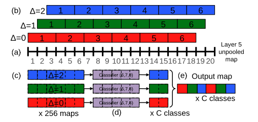
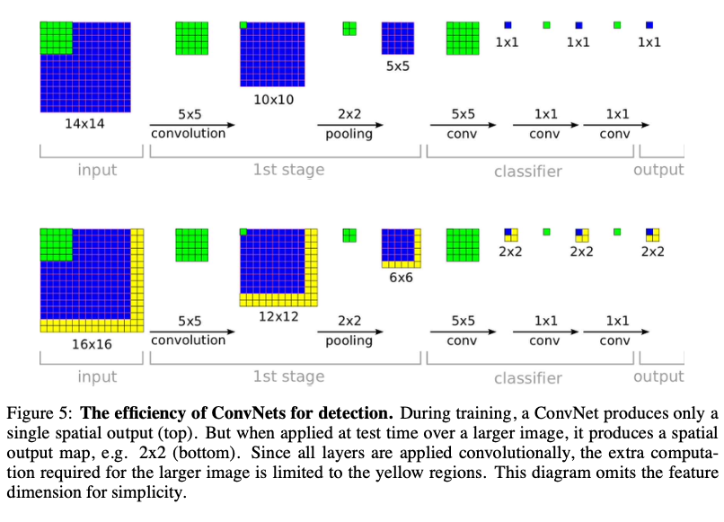
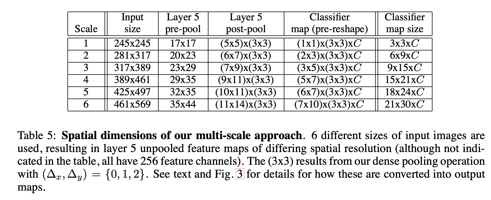
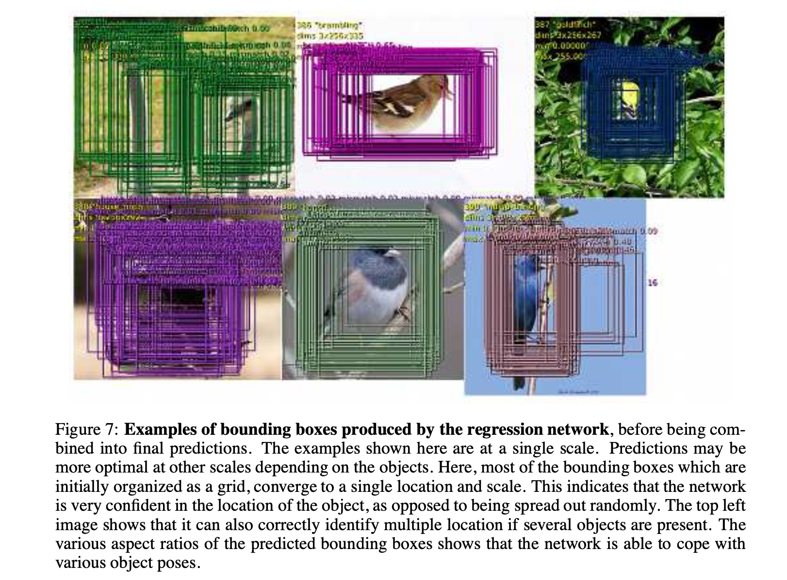
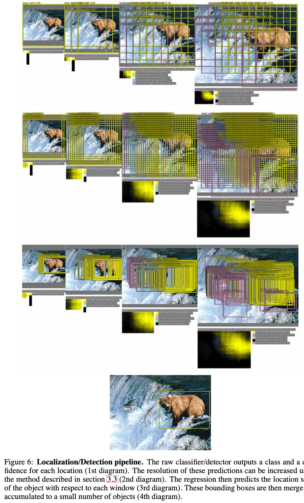

[[2013sermanet_overfeat.pdf]] 
#deep-learning #computer-vision

[[2012krizhevsky_alexnet.md]]

# Contribution

   Introduced new CNN architecture featuring multiscale sliding-window approach that got 4th/1st/1st on ImageNet 2013 competition in classification, localization, and detection, respectively. 14.18% error rate for accurate model, and ensemble of 7 accurate models gives 13.6% error. 

# Background 

   At this point, classification is getting significantly easier. Most pictures in datasets are centered objects that fills up much of the image, but this is not always the case in practice. There are two generalizations/levels of this problem, with each task being a subtask of the next (there is also the problem of semantic segmentation, which is also relevant). 

   1. *Classification*. Which class do we label this picture? 
   2. *Localization*. Classification + provide bounding box. Performance measured with probability (confidence) and IoU. Generally has large primary object(s). 
   3. *Detection*. Also classification + bounding box. But slightly different performance metrics, and it tends to have smaller objects that may be harder to detect. There is also the possibility of no object of interest. 

# Multiscale Voting 

   This is used for all 3 types, so should be covered first. Employ **multiscale classification** by extending multiview voting from AlexNet (recall AlexNet takes in two 224x224 patches from 256x256 image, classifies each patch, and then computes average). 

   This may not be the most robust, so we do a few things. 
   1. Densely run the network at each location and at multiple scales for more flexibility. 
   2. Increase the resolution of the images and then run convolutions again (of different sizes so outputs are same). 

### Dense Offsetting

   Usually our subsampling leads to a ratio of say 36x, i.e. every 36x36 pixels, we have a scalar classifying. But our goal is to get the object as filled and in the center as possible, so we subsample with offset/overlap (so that we are not partitioning the image in the end), leading to a smaller ratio of say 12x. 
   1. For single image, start with unpooled layer 5 feature maps. 
   2. Each unpooled maps undergoes 3x3 max pooling operation (non-overlapping regions), repeated 3x3 times for $(\Delta_x, \Delta_y)$ pixel offsets of $\{0, 1, 2\}$. 
   3. This produces a set of pooled feature maps, replicated $3 \times 3$ times for different $(\Delta_x, \Delta_y)$ combinations. 
   4. The classifier has a fixed input size of $5 \times 5$ and produces a $C$-dimensional output vector for each location within pooled maps. The classifier is applied in sliding window fashion to the pooled maps, yielding $C$-dimensional output maps for a given $(\Delta_x, \Delta_y)$ combination. 
   5. The output maps for different $(\Delta_x, \Delta_y)$ combinations are reshaped into a single 3D output map (two spatial dimensions and $C$ classes). 

   

   This is computationally fine since we're working with convnets, and by including the padding we aren't really adding too much computation. 

   

### Resolution 

   We have different scalers that allow the network to be more robust, especially when computing bounding boxes. 

   

# Classification Architecture and Training 

   They have two models. The specific architecture is in the tables in the paper. Both totaling about 145M parameters compared to AlexNet of 60M, but num of connections are significantly different.  
   1. *Fast model* has 5 conv layers plus 3 FC layers. 2810M connections. 
   2. *Accurate model* has 6 conv layers plus 3 FC layers. 5369M connections. 
   Each image is assigned a single label corresponding to main object in image. 5 guesses are allowed per image. 

# Localization Architecture and Training 

   5 guesses are also allowed for image, but we also need a bounding box for the predicted object, which can be represented with a 4-vector. To be considered correct, the predicted box must match ground truth by at least 0.5 IoU (intersection over union). 

   Let's denote the convolutional feature extractor as $f$, and the classifier network as $g$. Then our model so far is $g \circ f$. Now take a regressor $h$ that outputs 4 numbers to represent bounding boxes, and our regression network is $h \circ f$. Similarly to the classifier, there are $3 \times 3$ copies throughout. Final regressor is class specific, with 1000 bounding boxes, one for each class. 

   For inference, we simultaneously run classifier and regressor across all locations and scales. They will give us two outputs. 
   1. The output of final softmax layer for class $c$ at each location provides score of confidence that $c$ is present (though not necessarily fully contained). Thus we can assign confidence to each bounding box. 
   2. The box dimensions, which are computed as such. 

      

   For training, remember that for each sample $(I, C, B)$ of the image, class, and bounding box, we augment the dataset to get $(I_{jk}, C, B)$ where we take subimages. Furthermore, $I$ is scaled to $I^s$, so we really have the dataset $(I_{jk}^s, C, B)$. 

   1. We take the subimages $I_{jk}^s \subset I$ and use the augmented labels $(I_{jk}^s, C)$ for classifier. Basic cross entopy. 
   2. For the bounding boxes, we have $(I_{jk}^s, B)$. If $B$ and $I_{jk}^s$ have less than 50% overlap, then don't use this training label since since the object is mostly outside of these locations, it will be better handled by regression windows that do contain the object. Use $L^2$ loss, though this could be changed to directly optimize IoU. 

   Multiscale training, where we scale up the image (up to a factor of 1.4 here), and then recompute the convolutions the same way, is important as it makes model robust and boosts confidence. This also leads to bounding boxes to have different sizes and dimensions. At this point, the entire network should produce results like this. 

   

   Then combine predictions with greedy merge strategy. Pretty simple to understand but tedious to write out. Check paper. This gives us one bounding box. Boom. A comprehensive figure of the whole process is shown below. 

    

# Detection

   The same process but more computation since multiple locations of the image trained simultaneously. There is one big difference. Since we need to predict lack of class, we take negative samples at random for training. They apparently do this on the fly (bootstrapping) as choosing negative samples is nontrivial. Focus on the most offending negative samples and make sure to pay attention to size so model doesn't overfit. 

   Detection ranked 3rd, with 19.4 mAP (mean avg precision). 
