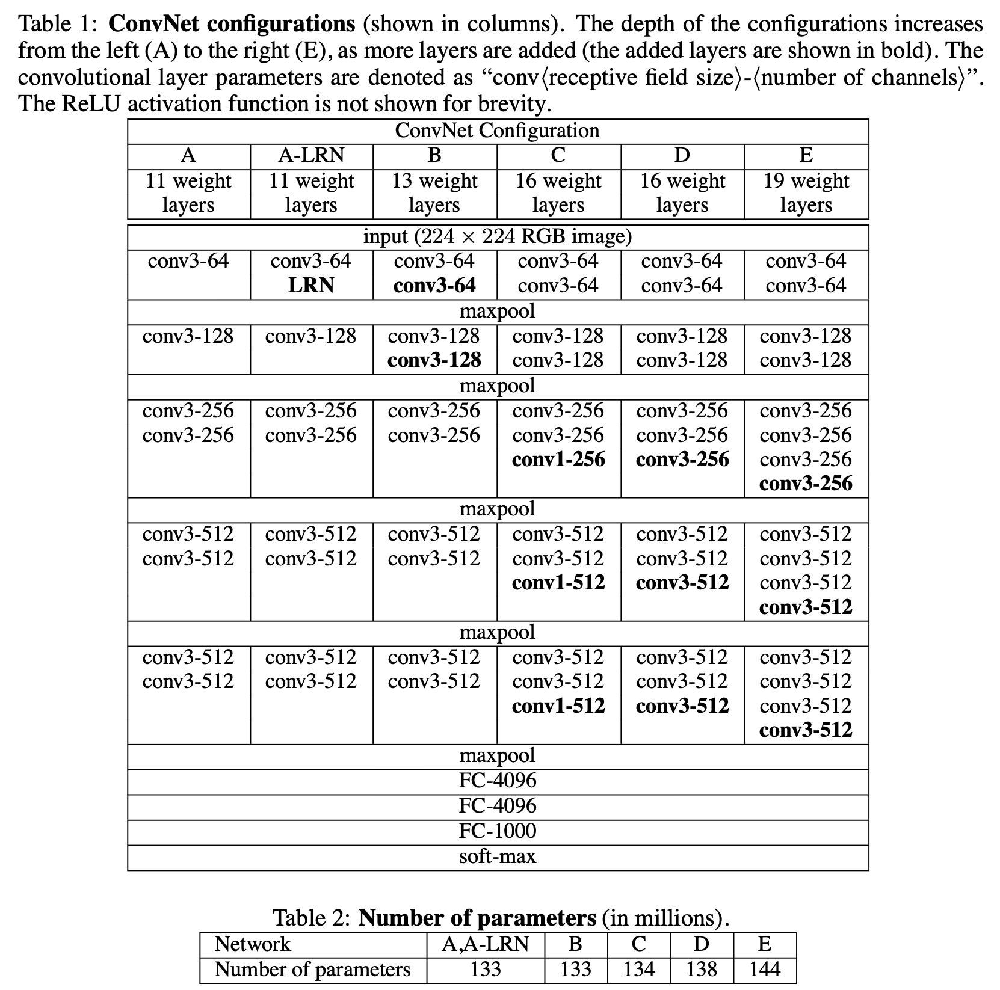

[[2014simonyan_vgg.pdf]]
#deep-learning #computer-vision

[[2012krizhevsky_alexnet]], [[2013sermanet_overfeat]]

# Contributions  

   Introduced an even deeper 19-layer CNN that was SOTA for ImageNet-1k, with top-1 and top-5 error fo 25.5% and 8%. 

# Background 

   CNNs are more of a commodity in DL and there have been efforts to improve AlexNet. Some include smaller receptive field sizes, sliding window techniques, but we tackle it by just adding more layers. 

# Architecture 

   Inputs are 224x224 RGB image which are shifted to have mean 0 for preprocessing. Actual images randomly cropped to 224x224. 

   Adding more layers is feasible since they only work with small $3 \times 3$ convolutions, with $2 \times 2$ max pooling (with stride 2). Build 6 different models as shown below. Everything has ReLU. 

   

   Notice that that the 1x1 convolutions are really just linear projections onto the same space, followed by a ReLU. This is just a way to increase the nonlinearity of model.  

# Training 

   Standard SGD with batch size 256, momentum 0.9, lr $10^{-2}$ weight decay $5 \cdot 10^{-4}$, with lr decreased by factor of 10 when validation accuracy plateaued (done 3 times over 74 epochs). Dropout set to 0.5. 

   Also did some normalization layers but did not help. 

   Initialization was important, so did random for model A, and as we kept adding layers we fixed some weights trained on previous runs. 

