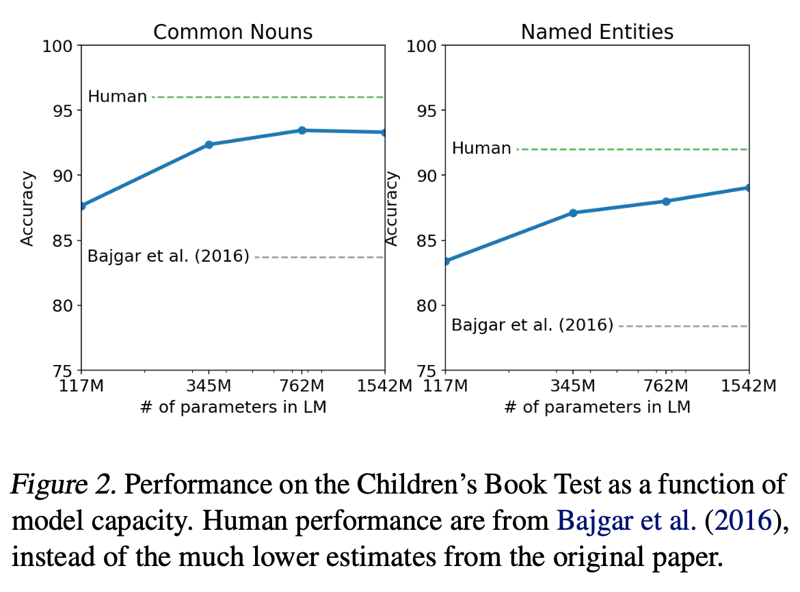
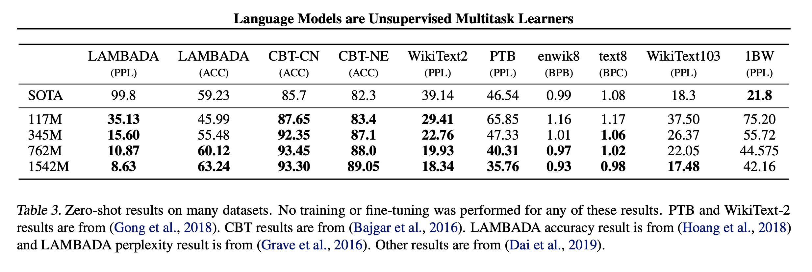

[[2019radford_gpt2.pdf]]
#deep-learning
#attention
[[2018radford_gpt]], [[2016sennrich_nmt-rare-words-subword-units]]
   

# Contribution 

   Basically makes the GPT1 architecture bigger, with more layers and hidden dimensions, along with some minor normalization changes. One notable thing is the tokenization, which they use byte pair. This achieves SOTA across the board. 

# Background 
 
   Most previous models are trained on too specific datasets and so they are more like narrow experts than competent generalists. Recent efforts by GPT1 and BERT had shown that generative pretraining is very effective. In fact, even with generative pretraining alone (and no discriminative fine-tuning) we can still achieve better accuracy if given a large enough unsupervised dataset, i.e. that such models can perform downstream tasks in a zero-shot setting. 

   We focus on language modeling, which is convenient since for may different tasks (e.g. QA, text classification, summarization), we can always model them as a sequence, perhaps with some delimiters. To expand on the theory behind this zero shot learning, they say that the supervised objective is the same as the unsupervised objective, but only evaluated on a subset of the sequence, and so the global minimum of the unsupervised objective is also the global minimum of the supervised objective. Therefore, the problem reduces to simply minimizing the unsupervised objective. 

   This may seem like a large leap from the structured datasets we see in, say QA (with question answer pairs), but they think that it might be enough to simply be able to forward predict the next sentence. Their speculation is that a language model with sufficient capacity will begin to learn to infer and perform the tasks demonstrated in natural language sequences in order to better predict them, regardless of their method of procurement. 

# Dataset 

   This deserves its own section since the quality, size, and diversity of the dataset is crucial. CommonCrawl (45M links) is an order of magnitude larger than other datasets, but the quality can be very low. Previous works have subsampled relevant portions of the dataset, but we want to avoid doing this. Rather, they use heuristic measures, e.g. looking at all outlinks to reddit threads/comments that have more than 3 karma. This subsample is about 8M docs (40GB), call it WebText. Also manually removed Wikipedia articles. 

# Unicode Encoding 

   We want our model to produce any string possible, and often the regular tokenization of the English language at the word level is prohibitive. Ideally, we want to tokenize at the character, or byte level, but this actually leads to poor performance. We want some middle ground, and so they use Byte Pair Encoding (BPE) from previous works on the rare word problem. It is a practical middle ground between character and word level language modeling which effectively interpolates between word level inputs for frequent symbol sequences and character level inputs for infrequent symbol sequences. 

   However, even with BPE, which actually models all Unicode strings, we would have a base vocabulary of 130k, which is too large compared to the 30k or 64k vocab from before. On the other extreme, byte level encoding gives us 256 vocabulary size. To avoid this, we prevent BPE from merging across character categories for any byte sequence. We add an exception for spaces which significantly improves the compression efficiency while adding only minimal fragmentation of words across multiple vocab tokens. This input representation allows us to combine the empirical benefits of word-level LMs with the generality of byte-level approaches.

   Ends up with vocab size of ~50k. 

# Architecture 

   They basically have the same architecture as GPT1, but with more layers. The largest has 1.5B parameters, more than 10x that of GPT1.

   | Parameters | Layers | d_model |
   |------------|--------|---------|
   | 117M       | 12     | 768     |
   | 345M       | 24     | 1024    |
   | 762M       | 36     | 1280    |
   | 1542M      | 48     | 1600    | 

   Some points. 
   1. LayerNorm was moved to input of each subblock, similar to a pre-activation resnet. 
   2. An additional layer norm was added after the final attention block. 
   3. Scale weights of residual layers at initialization by factor of $1/\sqrt{N}$ where $N$ is number of residual layers. 
   4. Context size increased from 512 to 1024 tokens. 

# Training 

   LR was manually tuned during training. 

   All models still underfit WebText. 

# Results 

   An advantage of this model is that due to the byte pair tokenization, we don't need to do any other tokenization or preprocessing on other datasets. UNK tokens that are not present in WebText is extremely rare. 

   The Children's Book Test is created to test LLMs on different categories of words, such as names, nouns, verbs, etc. These scores all increase as we increase model complexity and almost reaches human level. 

    

   The LAMBADA dataset was created to test long-range dependencies. Task is to predict final words of sentences which require at least 50 tokens of context. Crushes SOTA. 

   

   They do further tests and make qualitative observations on 
   1. Summarization 
   2. Reading comprehension 
   3. Translation 
   4. Question Answering 

   They also talk about how there tends to be some overlap between the train and tests sets (e.g. CIFAR-10 has a 3.3% overlap between train and test sets). This may cause the model to memorize rather than genealize. Therefore, they checked and preprocessed WebText to make sure that overlap is upper bounded by $1/10^8$. 

