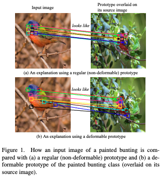

[[2021donnelly_deformable-protopnet.pdf]]
#interpretable #prototype 
[[2019chen_protopnet]], [[2021wang_tesnet]], [[2009felzenszwalb_object-detection-deformable]], [[2017dai_deformable-convnets]]

# Contributions 

   Developed prototype network with spatially flexible **deformable** prototypes as shown below. This is different from having 9 different prototypes on a vanilla ProtoPnet. Rather, the 9 squares represent *one*  deformable prototype. More explained later. 

   

   1. Angular margins to training algorithm. 

   2. Achieves SOTA accuracy on CUB-200-2011 and Stanford Dogs. 

   3. Builds upon the architecture of vanilla ProtoPnet, the orthonormality and cosine similarity from TesNet, and the deformable operations as deformable convolutions. 

# Model and Inference

   Let  $z \in (\eta_1 \times \eta_2 \times d)$ be a tensor outputted from a convolutional backbone $f$ and let us denote $g$ as the prototype layer. Let $p^{(c, l)} \in (\rho_1 \times \rho_2 \times d)$  be the $l$th prototype of class $c$, with $\rho = \rho_1 \rho_2$. Letting $a, b$ represent the center of each patch and $m, n$ be the offsets, the similarity of a non-deformable prototype $p^{(c, l)}$ with patch centered at $z_{a, b}$ is 

   $$g(\mathbf{z})_{a,b}^{(c,l)} = \text{sim}\left(\sum_m \sum_n \|\mathbf{p}_{m,n}^{(c,l)} - \mathbf{z}_{a+m,b+n}\|_2^2\right)$$

   In a vanilla ProtoPnet, we worked with $\rho_1 = \rho_2 = 1$, and so we would look at each $1 \times 1$ patch in the latent representation to compute similarities.  But now we make the height/width of the prototypes larger. Since we do this, let's introduce terminology. Let $\hat{p}^{(c, l)} \in ( \rho_1 \times \rho_2 \times d)$ be a **deformable prototype** and each $1 \times 1$ patch $\hat{p}^{(c, l)}_{m, n} \in (1 \times 1 \times d)$ be called a **prototypical part**. For example, the figure above shows a deformable prototype of $9$spatial positions, of shape $3 \times 3 \times d$. 

   We impose the additional constraints all prototypical parts of a deformable prototype to have the following $L^2$ norm, which consequently restricts the norm of the entire prototype to be $1$.  We also require every spatial location of the image feature tensor to have the same $L^2$ length. This is done by just scaling the conv outputs directly, with some small value $\epsilon$ added to avoid scaling $0$ vectors. 

   $$\|\hat{p}|_{m, n}^{(c, l)}\|_2 = r = \frac{1}{\sqrt{\rho}}, \quad \|\hat{z}_{a, b}\|_2 = r = \frac{1}{\sqrt{\rho}}$$

   We do this to convert the $L^2$ to cosine similarity, making it only angle dependent. Letting $\mathrm{sim}(\kappa) = -(\kappa/2 - 1)$, we the definition of the prototype layer $g$ above is simplified to 

   $$g(\hat{z})_{a, b}^{(c, l)} = \sum_m \sum_n \hat{p}_{m, n}^{(c, l)} \cdot \hat{z}_{a + m, b + n}$$ which is the same as a convolution between $\hat{p}^{(c, l)}$ and $\hat{z}$, with the norm constraints. 

   To introduce the deformable part, we add an additional offset $\Delta_1, \Delta_2$, which gives 

   $$g(\hat{\mathbf{z}})_{a,b}^{(c,l)} = \sum_m \sum_n \hat{\mathbf{p}}_{m,n}^{(c,l)} \cdot \hat{\mathbf{z}}_{a+m+\Delta_1, b+n+\Delta_2}$$

   where $\delta_1 = \delta_1 (\hat{z}, a, b, m, n)$ and $\delta_2 = \delta_2 (\hat{z}, a, b, m, n)$ are functions depending on the parameters. Therefore, these offsets allow us to evaluate the similarity between a prototypical part $\hat{p}^{(c, l)}_{m, n}$ and the image feature $\hat{z}_{a + m + \Delta_1, b + n + \Delta_2}$ at deformed position. 

   The geometric interpretation is this. All prototypical parts and all interpolated image features live on a $d$-dimensional sphere of radius $r$, and so the two are considered similar if the angle is similar (i.e. has large cosine similarity). 

   $$g(\hat{\mathbf{z}})_{a,b,m,n}^{(c,l)} = \hat{\mathbf{p}}_{m,n}^{(c,l)} \cdot \hat{\mathbf{z}}_{a+m+\Delta_1, b+n+\Delta_2} \implies g(\hat{\mathbf{z}})_{a,b}^{(c,l)} = \cos \big( \theta(\hat{p}^{(c, l)}, \hat{z}_{a, b}^{\Delta} ) \big)$$

   With this, the similarity score between a deformable prototype $\hat{p}^{(c, l)}$ and the entire image $z$ is simply 

   $$g(\hat{z})^{(c, l)} = \max_{a, b} g(\hat{z})^{(c, l)}_{a, b}$$

# Interpolation

   To compute this $\Delta$, we use feature interpolation to define image features as fractional positions. Previous works used bilinear interpolation, but does not work here since it breaks the norm condition (i.e. lands outside of hypersphere). So we use a slightly modified one that takes 4 points on the hypersphere and interpolates between them. 
