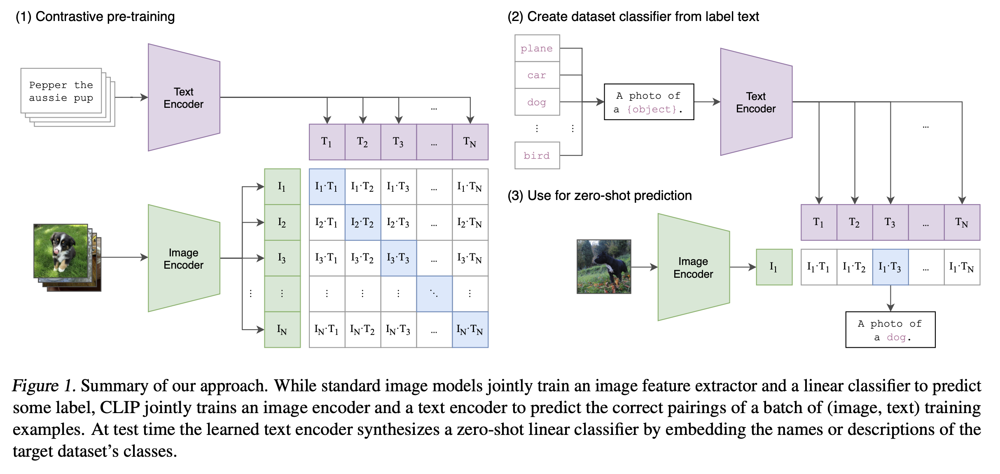

[[2021radford_clip.pdf]]
#deep-learning #computer-vision #natural-language-processing
[[2020dosovitskiy_vit]]

# Contribution 

   Introduces the CLIP model. Recognizes the limitations of having a fixed set of classes for SOTA vision models. Learning directly from raw text about images is a promising alternative which leverages a much broader source of supervision. We demonstrate that the simple pre-training task of predicting which caption goes with which image is an efficient and scalable way to learn SOTA image representations from scratch on a dataset of 400 million (image, text) pairs collected from the internet. After pre-training, natural language is used to reference learned visual concepts (or describe new ones) enabling zero-shot transfer of the model to downstream tasks. 

# Background 

   In NLP, pretraining on unlabeled text had really boosted zero-shot transfer learning capabilities. However, in vision it is still common to pretrain models on *crowd-labeled* datasets.  

# Model 

   

