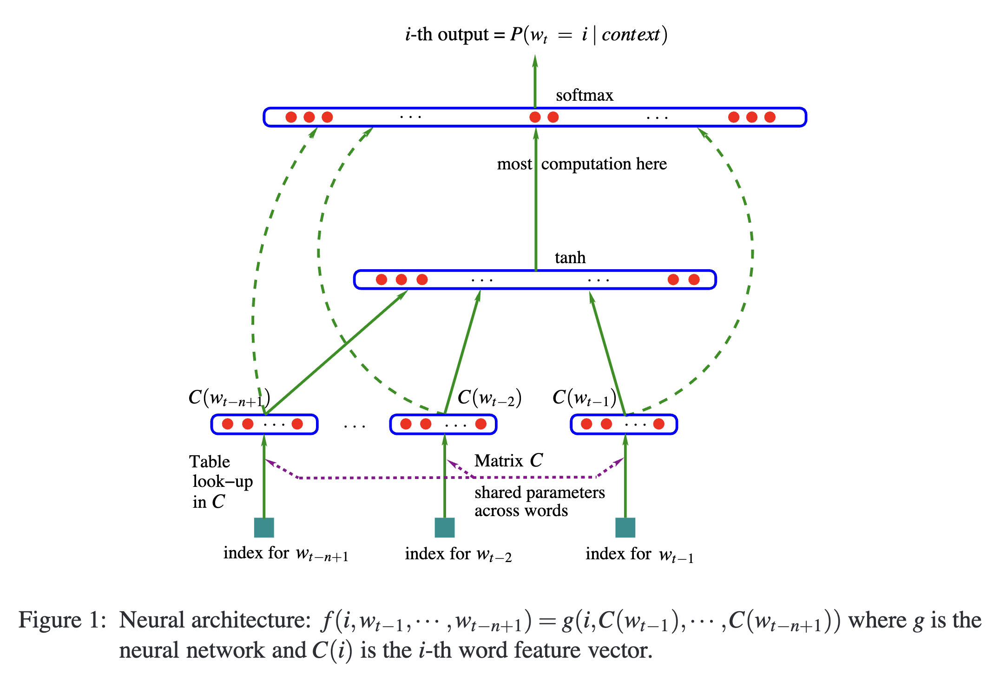

[[2003bengio_neural-prob-language-model.pdf]]
#language
# Contributions 

   Uses feedforward neural net to concurrently learn the two things. 
   1. Associate each word in vocabulary to a distributed word feature vector (i.e. continous) in $\mathbb{R}^m$. 
   2. Compute the joint probability function of word sequences in terms of the feature vectors of the word of each sequences. 

# Background

   Curse of dimensionality is worse in discrete RVs rather than continuous ones. Continuous ones have some local smoothness property that restricts the search space, but this is not necessarily true for discrete. Any change of discrete variables may have drastic impact on the value of function to be estimated. 

   N-gram models only look at a local window, and this is a disadvantage. A bigger one is that it doesn't take into account the similarity between words. That is the sentence "A * was running in the **." can model * at 
   'cat' or 'dog' since they are semantically similar, while ** might be 'room' or 'bedroom'. 

   TODO: previous attempts to learn word representations based off on whether they are in the same document or not, called Latent Semantic Analysis. 

# Architecture 

   The model is very simple. Let the vocabulary be $V$ with each word indexed with $i = 1, \ldots, |V|$. Our data will consist of the words $w_1, \ldots, w_t$, which we will denote $w_1^{t}$. Let us try to approximate their joint distribution by first conditioning 

   $$ 
      P(w_1) \cdot P(w_2 \mid w_1) \cdot \ldots \cdot P(w_t \mid w_1^{t-1})
   $$

   and then each conditional probability with a function $f$ 
   
   $$ 
      P(w_t \mid w_1^{t-1}) \coloneqq f(w_t, \ldots, w_{t-n+1})
   $$
   
   where $n$ is a context window size where we cut off looking, similar to $n$-grams. $f$ works in two parts. 
   1. First, we have a simple lookup table (a matrix) $C \in \mathbb{R}^{|V| \times m}$ that maps $i \in \mathbb{N} \mapsto C(i) \in \mathbb{R}^m$, i.e. a word to its feature vector. 
   2. Then we run the word embeddings through a feedforward neural network $g: (\mathbb{R}^m)^n \to \mathbb{R}^{|V|}$. 

   So this is represented as 

   $$
      P(w_t = i \mid w_1^{t-1}) = g\big( C(w_{t-1}), \ldots, C(w_{t-n+1}) \big)_i 
   $$ 

   though in the original paper he has weird notation. 

   

   They also have a parallel implementation. 

# Training

   Now we train it to maximize log likelihood of training data. 
   
   $$ 
      L = \frac{1}{T} \sum_t \log f(w_t, w_{t-1}, \ldots, w_{t-n+1}; \theta) + R(\theta)
   $$ 
   
   This can be easily parallelized, and there is a regularization term as well. 

