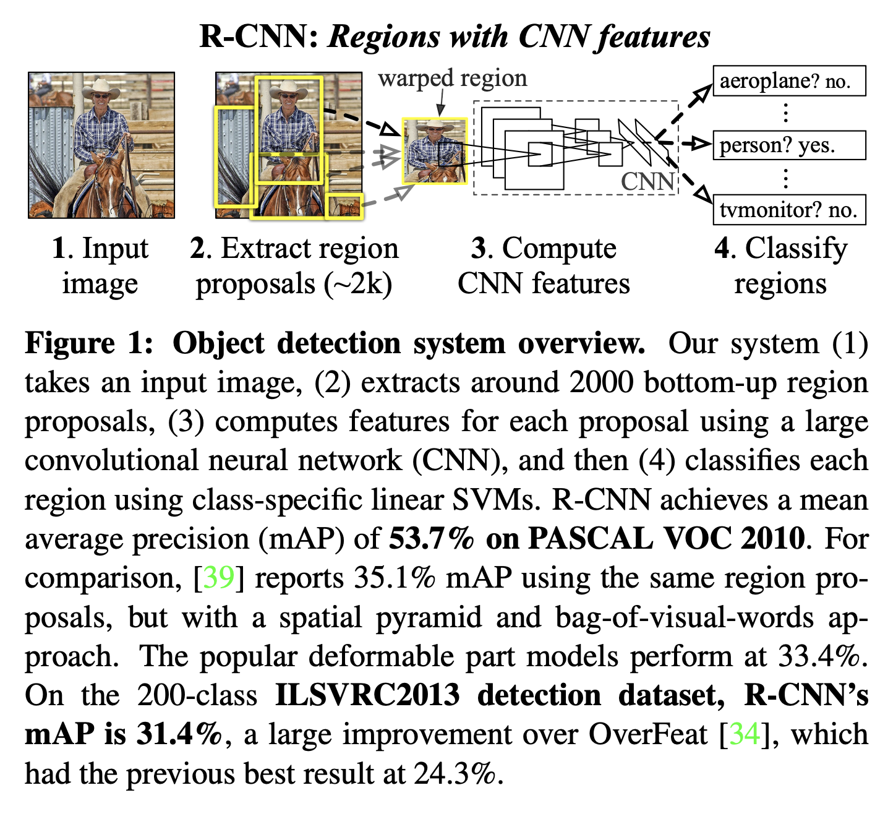

[[2013girshik_rcnn.pdf]]
#architecture
[[2013uijlings_selective-search]], [[2013sermanet_overfeat]]

# Contributions 

   Creates a region-proposal based CNN using semantic segmentation for object detection, vastly outperforming overfeat. Also recognizes the usefulness of transfer learning, where we pretrain on imagenet and then fine tune on a smaller dataset like VOC. 

# Architecture 

   There are 3 modules. 
   1. First generates category independent region proposals, which define the set of candidate subimages (regions) available to our detector. 
   2. The second is a large CNN that extracts a feature vector from each region. 
   3. Third is a set of class-specific linear SVMs. 

   Summarized below in figure. 

   

   Unlike AlexNet or Overfeat, which doesn't select subimages of size 224x224 very smartly, RCNN uses the already established selective search algorithm to generate the regions. Select about 2000 region proposals using selective search's fast mode. 

   Resize each regions to $227 \times 227$, which may warp it, but it's simple. Then feed it through CNN (uses AlexNet) with 4096-dimensional output as the feature vector. 

   For each class, we score each extracted feature vector using the SVM trained for that class. Given all scored regions in an image, we apply a greedy non-maximum suppression (for each class independently) that rejects a region if it has an intersection-over-union (IoU) overlap with a higher scoring selected region larger than a learned threshold.

   The memory is not too bad, since feature matrix is $2000 \times 4096$ and SVM weight matrix is $4096 \times N$ where $N$ is number of classes. So this linear scaling with number of classes is favorable. 

# Training 

   First discriminatively pretrain the CNN on Imagenet-1k, which almost is on par with AlexNet for 2012 competition from simple training. 

   Then fine-tune the CNN on warped region proposals, replacing the 1000-dimensional output layer with $N$-dimensional output layer. 

   Overlap threshold is important. Consider training a binary classifier to detect cars. It’s clear that an image region tightly enclosing a car should be a positive example. Similarly, it’s clear that a background region, which has nothing to do with cars, should be a negative example. Less clear is how to label a region that partially overlaps a car. We resolve this issue with an IoU overlap threshold, below which regions are defined as negatives. The overlap threshold, 0.3, was selected by a grid search over $\{0,0.1,...,0.5\}$ on a validation set. We found that selecting this threshold carefully is important. Setting it to 0.5 decreased mAP by 5 points. Similarly, setting it to 0 decreased mAP by 4 points. Positive examples are defined simply to be the ground-truth bounding boxes for each class.
