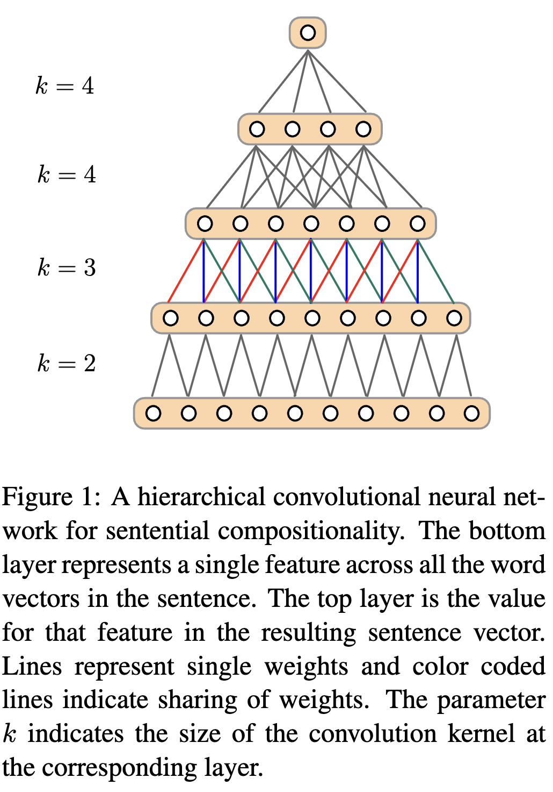
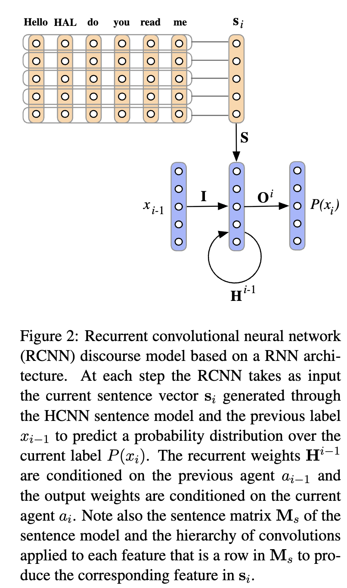
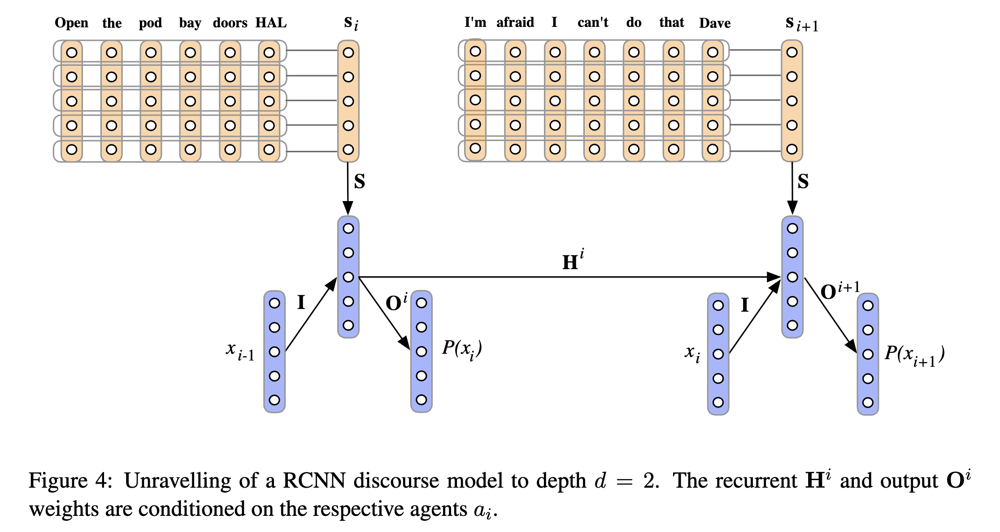

[[2013kalchbrenner_rcnn-discourse.pdf]]
#deep-learning
#natural-language-processing 
[[2010mikolov_rnn-language]]

# Contribution 

   Discourse is when multiple speakers chat with each other, and we would like to model it. It can be split into paragraphs, which can be split into sentences, which can be split into words. They have a meaning at a hierarchical level, yet are sequential in nature as well, so we want to use hierarchical convolutions paired with RNNs. We provide a model of discourse with RCNNs split into two parts. 
   1. Sentence model with hierarchical CNNs (HCNNs) that embed a sentence as a vector. 
   2. Discourse model with RNNs with inputs from HCNN and conditioned on respective speakers. 

# Sentence Model 

   A word is a vector, and given sentence $s$, let $M^s$ be the matrix where each column is the vector embedding of a word. Each row $\mathbf{m}$ describes the same feature of each word in the sentence, and we do a 1D convolution on it. 

   $$ 
     (\mathbf{k} * \mathbf{m})_i := \sum_{j=1}^{k} k_j \cdot m_{k+i-j} 
   $$ 

   This decreases the dimensionality of $\mathbf{m}$ and essentially compresses it. We now want to do this hierarchically, so we define a sequence of kernels of increasing size $\langle k_i^l \rangle_{i \leq t}. This is defined recursively as 

   $$
      k_1^l = 2, \quad k_{i+1}^l = k_i^l + 1, \quad k_t^l = l - \sum_{j=1}^{t-1}(k_j^l - 1)
   $$

   where the sequence is only dependent on the length of $\mathbf{m}$. That is, kernel sizes increase by one until the resulting convolved vector is smaller or equal to the last kernel size. The total number of elements $t = \sqrt{2l} - 1$, so it scales nicely (where $l$ is length of sentence). 

   Doing this for every row gives us a hierarchical sequence of matrices, and at the end, we have a single vector. This gives a scalar for each feature, and doing this for all rows reduces the matrix $M^s$ into a vector. 

    

# Discourse Model 

   We have a sequence of sentences $s_1, \ldots, s_T$ spoken so far, with labels $x_1, \ldots, x_T$ and their corresponding agents $a_1, \ldots, a_T$. Say that agent $a_i$ spoke sentence $s_i$. 
   1. The sentence $s_{i-1}$ gets processed by the HCNN to get the vector embedding $\mathbf{s}_i$. We process it with a linear map $\mathbf{S} \mathbf{s}_i$. 
   2. The label $x_{i-1}$ gets processed by the HCNN. $\mathbb{I} x_{i-1}$. 
   3. The current hidden state of the discourse is $\mathbf{h}_{i-1}$. Since agent $a_{i-1}$ uttered the last sentence, we should update it *conditioned* on that agent. Therefore we update it to $\mathbf{H}^{i-1} \mathbf{h}_{i-1}$, where $\mathbf{H}^{i-1}$ is conditioned on $a_{i-1}$. 
   4. We then add a bias and then our activation. 

   This gives us in total. 

   $$
      \mathbf{h}_i = \sigma( \mathbf{I} x_{i-1} + \mathbf{H}^{i-1} \mathbf{h}_{i-1} + \mathbf{S} \mathbf{s}_i + b_h)
   $$ 

   Now the output should be the probability of the next label. The next person to utter it will be agent $a_i$, and so the postprocessing should be conditioned on $a_i$ now. Therefore, we have 
   
   $$ 
      P(x_i \mid x_{< i}, s_{< i}, a_{< i}) = p_i = \mathrm{softmax}(\mathbf{O}^i \mathbf{h}_i + b_o)
   $$ 

   

   
