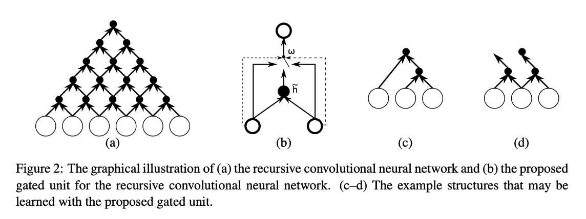

[[2014cho_encoder-decoder-properties.pdf]]
#language
[[2014cho_rnn-encoder-decoder-smt]]

# Contributions 

   Continues the line of RNN encoder-decoder architecture for NMT. Compares the performance of RNNs with Gated Hidden Neurons (prev paper) and the proposed Gated Recursive CNN. The GrCNN has a recursive formula that is akin to choosing child nodes in a binary tree (where leaves are the words $x_1, \ldots, x_T$). 

    

# Training 

   Bilingual parallel corpus (348M) and no monolingual data. Top 30k most words used are considered, rest are UNK token. Then performance of both models compared to SMT, where news-test2012 and 2013 were used to tune SMT, while 2014 was test set for comparison of BLEU. 

   For computational efficiency only sentences up to 30 words considered. 

   grConv has 2000 hidden neurons, while RNNenc has 1000. Word embedding dimension is 620. 

   Used AdaDelta (TODO: second time I've seen this, should look this up). 

   Standard beam search with width of 10 and chose top $k$ best translations. 

   Do not use usual log probability but one normalized w.r.t. length of translation to prevent RNN decoder from favoring shorter translations. 

