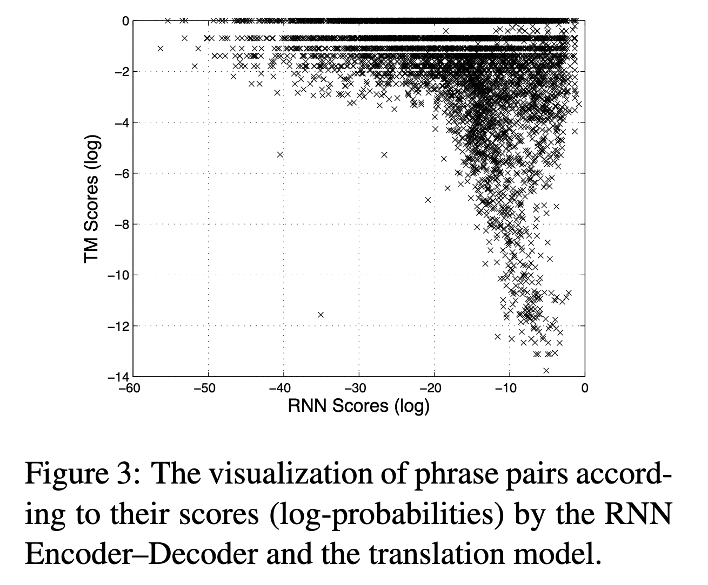

[[2014cho_rnn-encoder-decoder-smt.pdf]]
#deep-learning #natural-language-processing #generative
#natural-language-processing 
[[2013kalchbrenner_rnn-translation]]  

# Contribution 
   
   Introduces a RNN encoder-decoder architecture for translation (English to French), using a sophisticated hidden unit to improve memory capacity and ease of training. 

# Background 

   Given input sequence $e$ and output sequence $f$, we generally want to maximize  
   
   $$ 
      p(f \mid e) \propto p(e \mid f) \, p(f)
   $$
   
   where $p(e \mid f)$ is a translation model and $p(f)$ called a language model. In practice, most SMT systems model $p(f \mid e)$ as a log-linear model. 

   $$ 
      \log p(\mathbf{f} | \mathbf{e}) = \sum_{n=1}^{N} w_n f_n(\mathbf{f}, \mathbf{e}) + \log Z(\mathbf{e})
   $$ 

   where $f_n$ are some feature functions. So once the RNN is trained, it can be used for 2 things. 
   1. Generate target sequence given input sequence. 
   2. Can *score* a given pair of input-output sequences, where score is just the probability $p(x \mid y)$ (note that it is conditioned on the output!)  Then, we can use them in our log-linear model, and this has been popular. 

# Hidden Unit 

   Let's introduce the hidden unit. Note that in the encoder RNN, the hidden state is updated as 

   $$ 
      \mathbf{h}_{(t)} = f(\mathbf{h}_{(t-1)}, \mathbf{x}_t)
   $$
   
   that depends on the current input word and current hidden state. At the end of the encoder, we have a summary $\mathbf{c}$ of the input sentence in a fixed-length vector. However, the decoder hidden state is updated as 

   $$ 
      \mathbf{h}_{(t)} = f(\mathbf{h}_{(t-1)}, y_{t-1}, \mathbf{c})
   $$

   where it now depends on the previous output word along with the input embedding. The proposed hidden unit has 2-gates, is simpler than the LSTM, but still is good at remembering/forgetting. 

   Let us describe how the activation of the $j$-th hidden unit is computed. First, the \textit{reset gate} $r_j$ is computed by

   $$
      r_j = \sigma \left( [\mathbf{W}_r \mathbf{x}]_j + [\mathbf{U}_r \mathbf{h}_{(t-1)}]_j \right), \tag{5}
   $$

   where $\sigma$ is the logistic sigmoid function, and $[.]_j$ denotes the $j$-th element of a vector. $\mathbf{x}$ and $\mathbf{h}_{t-1}$ are the input and the previous hidden state, respectively. $\mathbf{W}_r$ and $\mathbf{U}_r$ are weight matrices which are learned.

   Similarly, the *update gate* $z_j$ is computed by

   $$
      z_j = \sigma \left( [\mathbf{W}_z \mathbf{x}]_j + [\mathbf{U}_z \mathbf{h}_{(t-1)}]_j \right). \tag{6}
   $$

   The actual activation of the proposed unit $h_j$ is then computed by

   $$
      h_j^{(t)} = z_j h_j^{(t-1)} + (1 - z_j) \tilde{h}_j^{(t)}, \tag{7}
   $$

   where

   $$
      \tilde{h}_j^{(t)} = \phi \left( [\mathbf{W} \mathbf{x}]_j + [\mathbf{U} (\mathbf{r} \odot \mathbf{h}_{(t-1)})]_j \right). 
   $$

   So when the reset gate is close to 0, the hidden state is forced to ignore the previous hidden state. On the other hand, the update gate controls how much information from previous hidden state will carry over. 

   After this, the architecture is just a simple RNN encoder decoder. 

# Training 

   Used 1000 hidden units with 100-dimensional embedding. 

   WMT 14 English/French phrases. 

   Adadelta and SGD. Random gaussian and used left singular vectors matrix to initialize recurrent weight matrices. Everything else was Gaussian with stddev 0.01. 

   Ignore the frequencies of phrase pairs in the corpora. Was done to reduce computation, but more importantly so that the RNN doesn't just simply learn to rank the phrase pairs by their number of occurrences. 

   Once the RNN Encoder–Decoder is trained, they add new score for each phrase pair to the existing phrase table. This allows the new scores to enter into the existing tuning algorithm with minimal additional overhead in computation.

   It is possible to completely replace phrase table (with scores) with RNN encoder-decoder. But this is too computationally heavy (due to sampling) to be performed repeatedly, so they only consider rescoring phrase pairs. 

# Results 

   To see effectiveness, tried more traditional technique of using neural network for learning target language model, called CLSM (TODO: need to review this, citation mentioned in paper). Compared CLSM (with 7-grams and embedding space dimension of 512) and phrase scoring. 

   Also tried penalizing number of words that are unknown to neural networks (i.e. words which are not in the short-list). Did it by adding number of unknown words as an additional feature in log-linear model. More details in footnotes. 

   | Models | BLEU dev | BLEU test |
   |--------|----------|-----------|
   | Baseline | 30.64 | 33.30 |
   | RNN | 31.20 | 33.87 |
   | CSLM + RNN | 31.48 | 34.64 |
   | CSLM + RNN + WP | 31.50 | 34.54 | 

   Concludes that there isn't too much correlation between CSLM and RNN, so independent improvements can be made. Compares the phrase rnn-based scores vs translation scores. 

   

   Does some analysis by taking word embeddings and seeing that it has semantic and syntactic meaning. 
