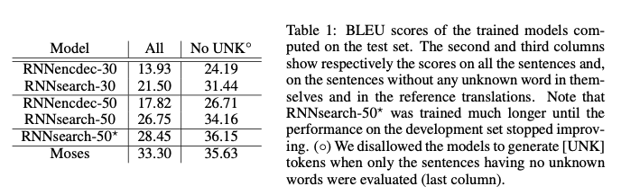
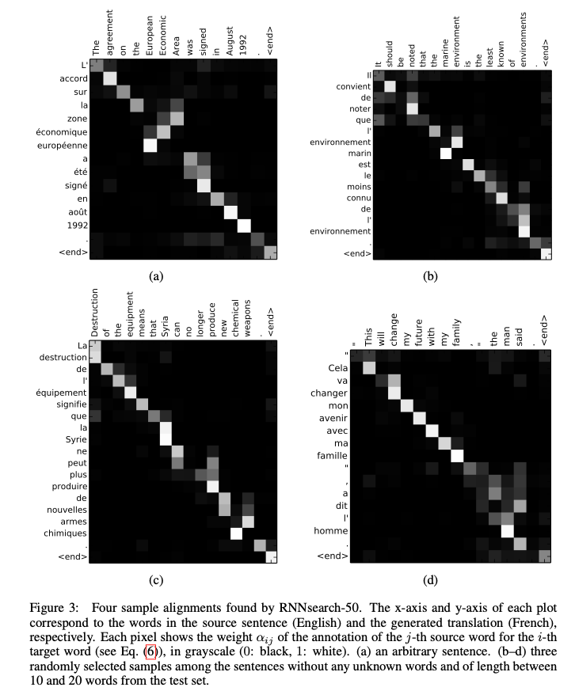

[[2015bahdanau_neural-machine-translation.pdf]]
#language, attention
[[2014cho_encoder-decoder-properties]], [[2014sutskever_seq2seq]]

# Contribution
   
   Introduces basically seq2seq with attention for English-French translation, called RNNsearch. The first significant paper to introduce attention, though the terminology of key, query, value was not established yet, and they used a feedforward neural net to compute the alignment values rather than a linear map. 

# Background 

   With an RNN, each conditional probability is modeled as 

   $$
      p(y_t | \{y_1, \cdots, y_{t-1}\}, c) = g(y_{t-1}, s_t, c)
   $$ 

   where $s_t$ is the hidden state, $y_{t-1}$ is the previous output, $c$ is the fixed length encoding of the input sentence (as in previous works), and $g$ is a nonlinear, potentially multilayered, function that outputs the probability of $y_t$. 

# Implementation 
   
   Their new architecture slightly modifies this. We define the conditional probability now as 

   $$
      p(y_t|y_1, \ldots, y_{t-1}, \mathbf{x}) = g(y_{t-1}, s_t, c_t),
   $$

   where $s_t$ is an RNN hidden state for time $t$, computed by 

   $$
      s_t = f(s_{t-1}, y_{t-1}, c_t).
   $$ 

   Note that we have $c_i$ rather than $c$, and each $c_i$ is a some **context vector** that depends on a sequence of annotations $(h_1, \ldots, h_{T_x})$ to which an encoder maps the input sequence. Each annotation $h_i$ can be seen as some vector that encodes information about the whole input sequence, with a strong focus on the parts surrounding the $i$th word of the input sequence. Then, the context vector is computed as a weighted sum of these annotations. 

   $$ 
      c_i = \sum_{j=1}^{T_x} \alpha_{ij} h_j, \alpha_{ij} = \frac{\exp(e_{ij})}{\sum_{k=1}^{T_x} \exp(e_{ik})} 
   $$

   where 

   $$
      e_{ij} = a(s_{i-1}, h_j) 
   $$

   is an **alignment model** that stores how well the inputs in position $j$ and the output in position $i$ match. They model $a$ as a feedforward neural net, and the alignment is not really a latent variable. It must be soft in order to backprop. 

   This was a lot to digest, let's go through this. Note that $h_j$ are the hidden states of the encoder, indexed with $j$, while $s_i$ are those of the decoder, indexed with $i$. 

   1. A BiRNN consists of forward and backward RNN's. The forward RNN $\overrightarrow{f}$ reads the input sequence as it is ordered (from $x_1$ to $x_{T_x}$) and calculates a sequence of *forward hidden states* ($\overrightarrow{h}_1, \ldots, \overrightarrow{h}_{T_x}$). The backward RNN $\overleftarrow{f}$ reads the sequence in the reverse order (from $x_{T_x}$ to $x_1$), resulting in a sequence of *backward hidden states* ($\overleftarrow{h}_1, \ldots, \overleftarrow{h}_{T_x}$).

   2. We obtain an annotation for each word $x_j$ by concatenating the forward hidden state $\overrightarrow{h}_j$ and the backward one $\overleftarrow{h}_j$, i.e., $h_j = [\overrightarrow{h}_j; \overleftarrow{h}_j]^T$. In this way, the annotation $h_j$ contains the summaries of both the preceding words and the following words. Due to the tendency of RNNs to better represent recent inputs, the annotation $h_j$ will be focused on the words around $x_j$. 

   3. Now for the decoder. At output time $i$, it takes its previous hidden state $s_{i-1}$ and all the context vectors $h_j$, and computes $e_{ij}$ through the feedforward net $a$. Then we normalize the $\{e_{ij}\}_{j}$ to get $\alpha_{ij}$. Then we take the affine combination to get the actual context vector $c_i$, which is used along with $s_{i-1}$ and the previous output $y_{i-1}$ to get the next hidden state: $s_i = f(s_{i-1}, y_{i-1}, c_i)$. 

# Training 

   Trained on ACL WMT14 (850M words) and compares it to Cho's previous RNN encoder-decoder. No monolingual data, but might be useful to pretrain the encoder. Use news-test-2012 and 2013 for validation, and evaluate on 2014 as test set. 

   Tokenized using the Moses package of the first 30k words, with UNK tokens. No preprocessing, such as lower casing or stemming, to the data. 

   Used runs limiting sentences up to 30 and 50 words. They both have 1000 hidden units for both encoder and decoder. 

   SGD and Adadelta. Trained for approx 5 days. 

   Also does well on long sentences. 

   Results for BLEU. 

   

   Also visualizations on alignment. 

   

