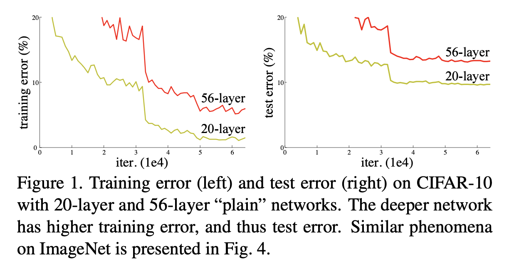
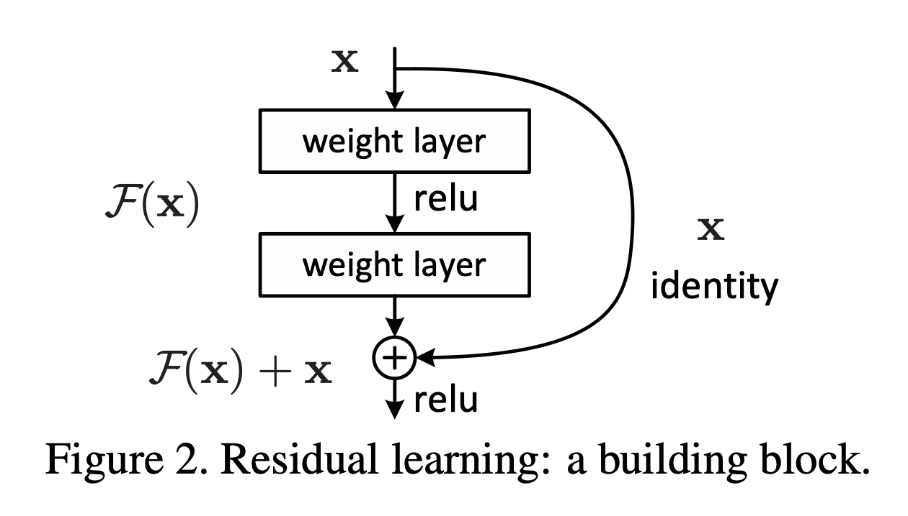
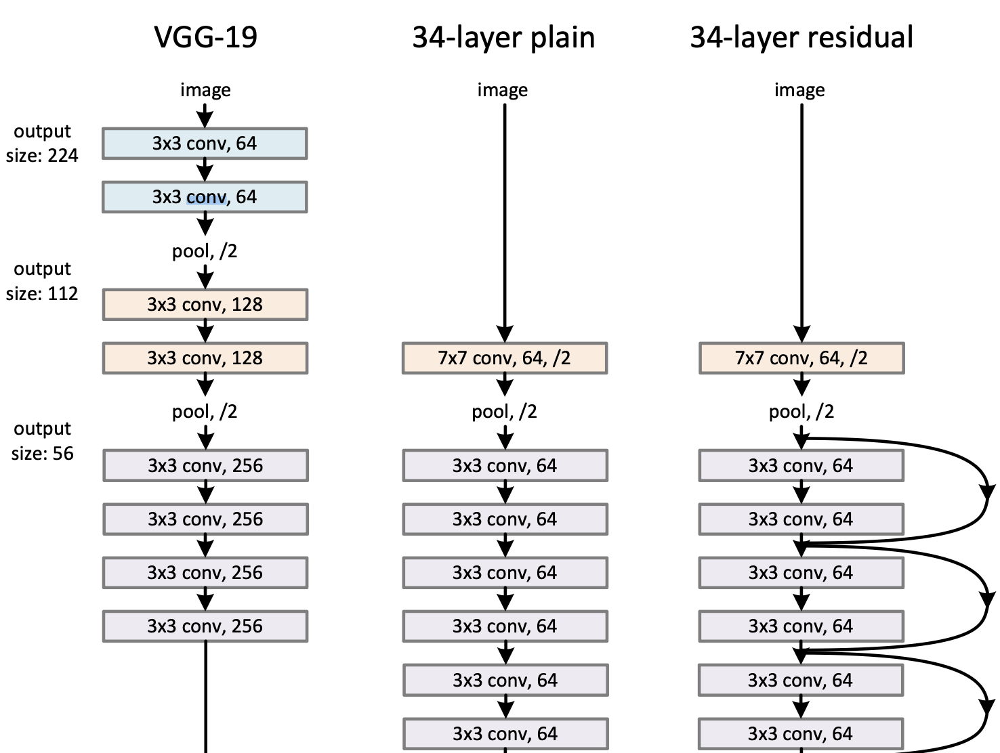
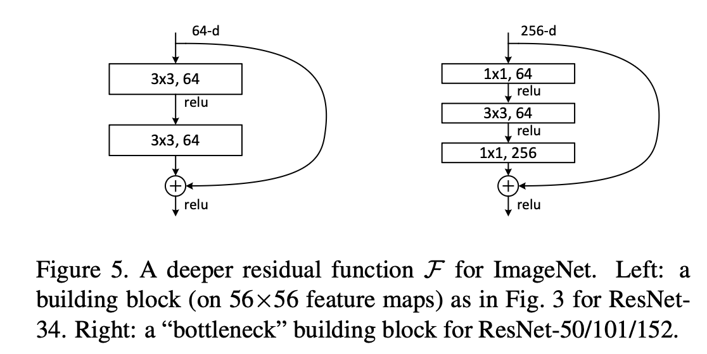

[[2015he_resnet.pdf]]
#deep-learning #computer-vision #discriminative

[[2014simonyan_vgg]]

# Contributions 

   Creates residual layers, which compute the residual function w.r.t. input, that are much easier to train. Allows us to train deep networks of up to 152-layers compared to 19 in VGG! Just increasing depth and successfully training gives 3.58% error on ImageNet (1st place 2015), plus 28% improvement in COCO. 

# Background 

   Turns out that if we increase depth of CNNs, the training and test error plateaus. This is called the degradation problem. 

    

   Argues that this difficulty is unlikely to be caused by vanishing gradients since these plain networks are trained with batch normalization. They also confirmed that gradients have healthy norms. Conjecture that deeper networks have exponentially slow convergence rates, but not sure why. 

# Residual Learning 

   Consider $\mathcal{H}(x)$ as underlying mapping to be fit by few stacked layers (not necessarily entire net). Under universal approximation, it would also be able to fit the residual mapping of form $\mathcal{F}(x) = \mathcal{H}(x) - x$. Theoretically equivalent but in practice may be easier. 

   The degradation problem may indicate that nets may have difficulties approximating identity mappings with multiply nonlinear layers. Identity mappings are certainly not always optimal, but they might be a good preconditioning. 

   These can be visualized as shortcut connections, and these shortcut connections in our case is simply the identity mapping. If the dimensions are different, we can either pad/remove elements or just have a projection matrix (which is equivalent to a 1x1 convolution). We will use this building block, called a residual block. 
   
    

   So stacking them, we have something like this. Note that we are careful to construct the shortcut connections as such so that the actual complexity of resnet-34 is less than vgg-19. 

    

   Do a comparison between resnets and vanilla CNNs, and show that training rates are drastically different. 

   
   
# Even Deeper: Bottleneck Layers 

   Things like looking bright by just making resnets deeper. But if we want to go even deeper into 152 layers, this will require too many parameters, so we look at an even simpler form of block. We call this the **bottleneck**, which uses a stack of 3 layers (1x1, 3x3, 1x1) rather than 2 (3x3, 3x3). This bottleneck is really the 1x1 convolution before the 3x3, which reduces the input dimension and improves computational complexity. Both designs have similar time complexity. 

   

   Even resnet-152 is 11.3B FLOPS compared to VGG-16's 15.3B FLOPS. 

   Trained and did successfully on CIFAR-10. Standard preprocessing and hyperparameters. 

   They explored even 1000+ deep layers, which had training errors of $< 0.1\%$ with 7.93% test error, with heavy regularization. So seems to peak at around 110-layer network. 
   
