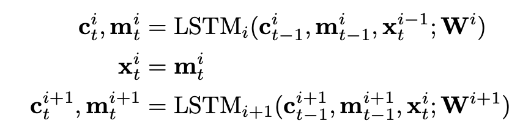

[[2015jean_large-vocab-for-nmt.pdf]]
#language
[[2015bahdanau_neural-machine-translation]]

# Contribution

   Propose a method to fix small vocab weakness in attention encoder-decoder NMT allowing them to use larger training set vocabulary without increasing vocabulary. 
 
# Background 

   NMT with attention is good, but it's limited due to not being able to handle large vocabulary. That is, the target vocabulary is limited and cannot be increased too much since including more and more rare words increases complexity of the model, leading to poor learning. In previous papers, they only took the first 30k-80k most frequent words and replace everything else with an UNK token. This works well for a few UNK tokens, but translation deteriorates rapidly with more. 

# Implementation 

## NMT  

   In Bahdanau, encoder is implemented by bidirectional RNN s.t. 

   $$
      h_t = \left[\overleftarrow{h_t}; \overrightarrow{h_t}\right], \qquad \overleftarrow{h_t} = f\left(x_t, \overleftarrow{h_{t+1}}\right), \quad \overrightarrow{h_t} = f\left(x_t, \overrightarrow{h_{t-1}}\right).
   $$

   The decoder at each time step, computes the context vector $c_t$ as a convex sum of hidden states $(h_1, \ldots, h_T)$ with coefficients $\alpha_1, \ldots, \alpha_T$ computed by 

   $$
      \alpha_t = \frac{\exp \{a (h_t, z_{t-1})\}}{\sum_k \exp \{a (h_k, z_{t-1})\}}
   $$

   where $a$ is a feedforward NN with one hidden layer. Then the new hidden state $z_t$ of the decoder is computed based on the previous hidden state $z_{t-1}$, previous generated symbol $y_{t-1}$, and the computed context vector $c_t = \sum \alpha_t x_t$. 

   The probability of the next target word is computed as 

   $$
      p(y_t | y_{<t}, x) = \frac{1}{Z} \exp \left\{ w_t^T \phi (y_{t-1}, z_t, c_t) + b_t \right\}, \qquad Z = \sum_{k:y_k \in V} \exp \left\{ w_k^T \phi (y_{t-1}, z_t, c_t) + b_k \right\}
   $$

   where $\phi$ is an affine transformation followed by a nonlinear activation, $\mathbf{w}_t$ and $b_t$ are the target word vector and bias, and $Z$ is the normalization constant over all target words $V$. 

   It is the computation of (the gradient of) this normalization constant that we want to optimize. The actual sizes of the matrices should be larger when the target vocabulary gets larger (or keep it small and have word embeddings). 

## Algorithm 

   Propose an approximate training algorithm based on biased important sampling to train and NMT model with much larger target vocabulary. Essentially, we just take a subset of the full target vocabulary and train the model with that. Once the model is trained, one can choose to use either all the target words or only a subset of them. The computational complexity becomes then constant w.r.t. size of vocabulary. 

   The main bottleneck of NMT is from the normalization constant $Z$ over all words in the target vocabulary $V$ when computing the gradient. The gradient of the log likelihood is 

   $$
      \nabla \log p(y_t \mid y_{< t}, x) = \nabla \mathcal{E}(y_t) - \underbrace{\sum_{k:y_k \in V} p(y_k \mid y_{< t}, x) \, \nabla \mathcal{E} (y_k)}_{\approx \mathbb{E}_P [\nabla \mathcal{E}(y)]}
   $$

   where $\mathcal{E}(y_j) = \mathbf{w}_j^T \phi(y_{j-1}, z_j, c_j) + b_j$, and the second term is the empirical approximation of the expected gradient of the energy. 

   Computing the expectation is difficult, and so we want to approximate this gradient with importance sampling with a small number of samples. We only use a small subset $V^\prime$ of the target vocabulary at each update and use this noisy approximator. In detail, given a predefined proposal distribution $Q$ and subset $V^\prime \subset V$ from $Q$, we approximate the expectation as 

   $$
      \mathbb{E}_P [\nabla \mathcal{E}(y)] \approx \sum_{k:y_k \in V^\prime} \frac{\omega_k}{\sum_{k^\prime : y_{k^\prime} \in V^\prime} \omega_{k^\prime}} \nabla \mathcal{E}(y_k), \qquad \omega_k = \exp\{ \mathcal{E} (y_k) - \log{Q(y_k)}\} 
   $$

   Therefore, we can compute the normalization constant using only small subset of target vocab. 

## Partitioning Words for Parameter Control 

   This reduces computational complexity, but this doesn't guarantee that the number of parameters being updated is bounded nor controlled. This is problematic for GPUs which have limited memory. 

   Therefore, we have a integer threshold $\tau$, and we subsample from the dataset such that there are a total of $\tau$ unique target words $V^\prime$. Now do this a bunch of times to get $V_1^\prime, \ldots$. 
   1. Therefore, we partition the data, and for the $i$th partition, we define $V_i^\prime$ as its subset of unique target words, where $|V_i^\prime| \leq \tau$. 
   2. This can be understood as having a separate proposal distribution $Q_i$ for each partition of the training corpus. The distribution $Q_i$ assigns equal probability mass to all target words included in the subset $V_i^\prime$ and $0$ probability mass to all other words. 
   3. The choice of proposal distribution cancels out the correction term, and with some simplification of math, we have 
   $$
      p(y_t \mid y_{< t}, x) = \frac{\exp \left\{ w_j^T \phi (y_{t-1}, z_t, c_t) + b_j \right\}}{\sum_{k:y_k \in V} \exp \left\{ w_k^T \phi (y_{t-1}, z_t, c_t) + b_k \right\}}
   $$
   However, this makes the estimator biased. 

## Decoding 

   Once model is trained, we can use full target vocabulary. However, the expensive part is not just computing the gradient of the normalization term, but just the normalization term itself. Therefore, we can use a subset of the candidate target words during decoding, which is similar to what we do in training, except at test time we don't have access to a set of correct target words. 

   Obviously, we don't want to just take the top $K$ most frequent words, as it defeats the whole purpose of trying to train the whole vocabulary. Rather, we can use an existing word alignment model to align the source and target words and then build a dictionary. With the dictionary, for each source sentence, we construct a target word set consisting of the $K$-most frequent words, and using the dictionary, at most $K^\prime$ likely target words for each source word. This is called a *candidate list*. 
   
   Therefore, we can infer the source word to which each target word was most aligned. Once a translation is generated given source sentence, each UNK token may be replaced using a translation-specific technique based on the aligned source words. There are more possibilities, which can be explored in future papers. 

# Training 

   Use RRNsearch from Bahdanau as baseline model, which was trained on 30k words. 

   For each language pair, we train our set of RNNsearch models with much larger vocabularies $50,000$ call them RNNsearch-LV. 

   $K \in \{15k, 30k, 50k\}$ and $K^\prime \in \{10, 20\}$.

   Same old WMT2012 and 13 for train, 14 for test. English to French. 

   $\tau = 15,000$ and $30,000$ for French, 15k and 50k for English to German. 

   To stabilize parameters, at end of training stage we freeze word embeddings and tune only other parameters for 2 more days. 

   Beam search with length normalization with a set of 12 hypotheses (what does this mean?). 

# Results 

   Everything is BLEU. Clearly RNNsearch-LV outperforms all other. 

   
