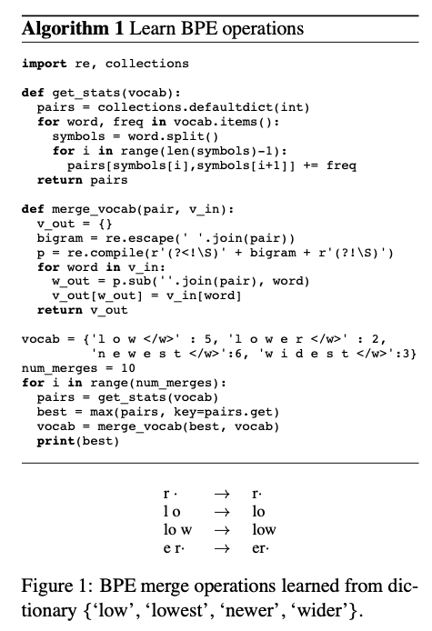

[[2016sennrich_nmt-rare-words-subword-units.pdf]]
#language 
[[2015luong_attention-nmt]]

# Contributions 

   We encode rare and unknown words as sequences of subword units, based off the intuition that word classes are translatable via smaller units than words. Explore with n-gram models and segmentation based off on byte pair encoding compression. 

# Background 

   Same rare word problem for NMT. Previous works just use positional encodings and map unknown tokens to a dictionary. This works okay for names, but there isn't really a 1-to-1 correspondence between source and target words. 

   You can encode them through subwords due to etymology, and an analysis of 100 rare tokens (not among the 50k most frequent types) in German training data show that majority of tokens are potentially translatable from English through smaller units. 

# Byte Pair Encoding 

   BPE is a simple data compression technique invented in 1994. It iteratively replace the most frequent air of bytes in a sequence with a single, unused byte. We adapt this algorithm for word segmentation. Instead of merging frequent pairs of bytes, we merge characters or character sequences.
   1. Initialize symbol vocab with character vocab, and represent each word as a sequence of characters, plus a special end-of-word symbol $\cdot$, which allows us to restore original tokenization after translation.  
   2. We iteratively count all symbol pairs and replace each occurrence of the most frequent pair (e.g. A, B) with a new symbol (e.g. AB). Each merge operation produces a new symbol with represents a character $n$-gram. 
   3. Frequent character $n$-grams (or whole words) are eventually merged into a single symbol, thus BPE requires no shortlist (i.e. the limited vocabulary of the most frequent words). 
   4. For efficiency, don't consider pairs that cross word boundaries. 

   

   The difference other other compression algos like Huffman, which have been proposed to produce variable length encoding of words for NMT (interesting, should read this) is that their symbol sequences are still interpretable as subword units, and network can generalize to translate and produce new words. 

   There are two methods of doing BPE given source and target vocabularies $S$ and $T$. 
   1. Learn two independent encodings for $S$ and $T$. This is more compact in terms of text and vocab size, with stronger guarantees that each subword unit has been seen in the training text of respective language. 
   2. Learn an encoding for $S \cup T$. This improves consistency between source and target segmentation. 

# Results 

   Experiments on data on WMT 2015. 
   1. English to German has training set 4.2M sentence pairs, 100M tokens. 
   2. English to Russian has 2.6M sentence pairs, with 50M tokens. 

   Use newstest2013 as development set, and 2014/15 for test.  

   Use Adadelta like Bahdanau, minibatch size 80, trained for 7 days. Beam size of 12. 

   Corpus statistics for German training corpus with different word segmentation techniques. #UNK: number of unknown tokens in newstest2013.

   | segmentation | # tokens | # types | # UNK |
   |---------------|----------|---------|-------|
   | none | 100 m | 1750000 | 1079 |
   | characters | 550 m | 3000 | 0 |
   | character bigrams | 306 m | 20000 | 34 |
   | character trigrams | 214 m | 120000 | 59 |
   | compound splitting^Δ | 102 m | 1100000 | 643 |
   | Morfessor* | 109 m | 544000 | 237 |
   | hyphenation^◊ | 186 m | 404000 | 230 |
   | BPE | 112 m | 63000 | 0 |
   | BPE (joint) | 111 m | 82000 | 32 |
   | character bigrams | | | |
   | (shortlist: 50000) | 129 m | 69000 | 34 |

   English to Russian translation performance (BLEU, CHRF3 and unigram F₁) on newstest2015. Ens-8: ensemble of 8 models. Best NMT system in bold. Unigram F₁ (with ensembles) is computed for all words (n = 55054), rare words (not among top 50000 in training set; n = 5442), and OOVs (not in training set; n = 851).

   | name | segmentation | shortlist | vocabulary | target | BLEU | | CHRF3 | | unigram F₁ (%) | | |
   |------|-------------|-----------|------------|--------|------|------|-------|------|----------------|------|------|
   | | | | source | | single | ens-8 | single | ens-8 | all | rare | OOV |
   | phrase-based (Haddow et al., 2015) | - | - | - | - | 24.3 | - | 53.8 | - | 56.0 | 31.3 | 16.5 |
   | WUnk | - | 300000 | 500000 | 22.4 | 46.5 | 49.9 | 54.2 | 25.2 | 0.0 |
   | WDict | - | - | 300000 | 500000 | 19.1 | 22.8 | 47.5 | 51.0 | 54.8 | 26.5 | 6.6 |
   | C2-50k | char-bigram | 50000 | 60000 | 60000 | 20.9 | 24.1 | 49.0 | 51.6 | 55.2 | 27.8 | 17.4 |
   | BPE-60k | BPE | - | 60000 | 60000 | 20.5 | 23.6 | 49.8 | 52.7 | 55.3 | 29.7 | 15.6 |
   | BPE-90k | BPE (joint) | - | 90000 | 100000 | 20.4 | 24.1 | 49.7 | 53.0 | 55.8 | 29.7 | 18.5 |

