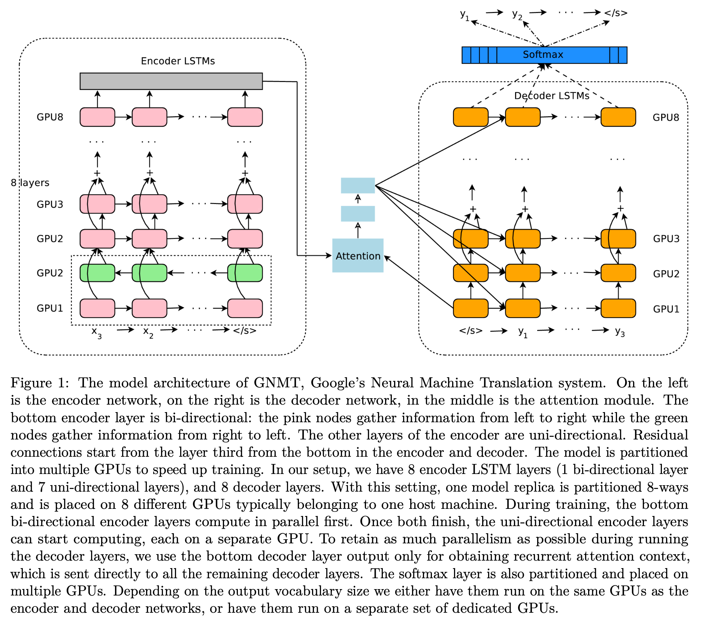

[[2016wu_google-nmt.pdf]]
#natural-language-processing
[[2015luong_addressing-rare-word-prob-nmt]], [[2012schuster_jap-kor-voice-search]]

# Contribution 

   Uses deep LSTM encoder-decoder with attention, plus sub-word units, to create a SOTA model. It was used in production for Google translate from 2016 to 2020. 

# Background 

   While nmt with attention is nice, it has three large weaknesses. 
   1. Hard to train, especially with deep networks. Therefore, they use residual connections. 
   2. Ineffective against rare words. Therefore, they divide words up into sub-word units, aka wordpieces, which is a nice balance between character and word level tokenization. 
   3. Fails to translate all words in the sentence.  

# Architecture  

   Has encoder, decoder, and attention layer. 

   

   Encoder 
   1. 8 LSTM layers for encoder. Must be deep enough to capture nuances. 
   2. This has gradient problems, so we use residual connections. All hidden dimensions are the same, 
   3. 1st encoder layer is bidirectional because we don't want to only process left-to-right. The rest of the layers are unidirectional since we want to maximize parallelism.  

   Given words $x_1, \ldots, x_M$, we encode them with the multilayer LSTM to get $\mathbf{x}_1, \ldots, \mathbf{x}_M$. Now time for the decoder. Let $\mathbf{y}_{i-1}$ be the output of the decoder from the previous time step. We want to compute the context vector with the attention layer. To do this, take each word embedding in the input sentence with the previous output, and compute 

   $$ 
   \begin{align}
      s_t & = AttentionFunction(y_{i-1}, x_t) \quad \forall t, \quad 1 \leq t \leq M \\
      p_t & = \exp(s_t) / \sum_{t=1}^{M} \exp(s_t) \quad \forall t, \quad 1 \leq t \leq M \\
      a_i & = \sum_{t=1}^{M} p_t \cdot x_t
   \end{align}
   $$

   where $AttentionFunction$ is a feedforward NN with one hidden layer. With the context vector, we can compute 
   
   $$
      g(s_i, y_{i-1}, a_i)
   $$

   A regular LSTM layer looks like this. 

   $$
   \begin{align}
      s_t & = AttentionFunction(y_{i-1}, x_t) \quad \forall t, \quad 1 \leq t \leq M \\ 
      p_t & = \exp(s_t) / \sum_{t=1}^{M} \exp(s_t) \quad \forall t, \quad 1 \leq t \leq M \\ 
      a_i & = \sum_{t=1}^{M} p_t \cdot x_t
   \end{align}
   $$

   With residuals, we have this. 

   $$ 
   \begin{align}
      c_t^i, m_t^i & = \text{LSTM}_i(c_{t-1}^i, m_{t-1}^i, x_t^{i-1}; W^i) \\ 
      x_t^i & = m_t^i + x_t^{i-1} \\ 
      c_t^{i+1}, m_t^{i+1} & = \text{LSTM}_{i+1}(c_{t-1}^{i+1}, m_{t-1}^{i+1}, x_t^i; W^{i+1})
   \end{align}
   $$

# Wordpiece 

   Used a pretrained word-piece model from the Japanese and Korean paper. Trained to maximize the likelihood of training data. The wordpiece model is generated using a data-driven approach to maximize the language-model likelihood of the training data, given an evolving word definition. Given a training corpus and a number of desired tokens $D$, the optimization problem is to select $D$ wordpieces such that the resulting corpus is minimal in the number of wordpieces when segmented according to the chosen wordpiece model.

   Here is an example of a word sequence and the corresponding wordpiece sequence:
   1. Word: Jet makers feud over seat width with big orders at stake
   2. wordpieces: _J et _makers _fe ud _over _seat _width _with _big _orders _at _stake

   We also cut the number of basic characters to a manageable number depending on the data (roughly 500 for Western languages, more for Asian languages) and map the rest to a special unknown character to avoid polluting the given wordpiece vocabulary with very rare characters. We find that using a total vocabulary of between 8k and 32k wordpieces achieves both good accuracy (BLEU scores) and fast decoding speed across all pairs of language pairs we have tried.

# Training 

   Uses Google's TPUs along with low precision arithmetic for efficiency. 1024 hidden dimensions with 8 layers. 

   Used data parallelism with downpour SGD over 10 models with shared weights to train with SGD and Adam. 

   Used model parallelism to store each layer on a separate GPU. 

   Deployed using quantized model and quantized inference through clipping. This turns out to improve training, which they think it's because clipping is a form of regularization. 

   There are some reinforcement learning stuff. Idk. 

   Beam search (of size 3) with some length normalization (so it doesn't favor shorter sequences). Simply dividing by the length $L$ might be too naive, so they tried with $L^\alpha$, where $\alpha \in [0.6, 0.7]$. The beam search also doesn't just maximize log prob, but they have a custom score function. 

   $$
   \begin{align}
      s(Y, X) &= \log(P(Y|X)) / lp(Y) + cp(X; Y) \\
      lp(Y) &= \frac{(5 + |Y|)^{\alpha}}{(5 + 1)^{\alpha}} \\
      cp(X; Y) &= \beta * \sum_{i=1}^{|X|} \log\left(\min\left(\sum_{j=1}^{|Y|} p_{i,j}, 1.0\right)\right)
   \end{align}
   $$
   
   This scoring function addresses two critical flaws in raw probability maximization for beam search. First, the \textbf{length bias problem}: since probabilities multiply (becoming smaller), longer sequences always have lower probabilities, causing the model to favor overly short, incomplete translations. The length penalty $lp(Y) = \frac{(5 + |Y|)^{\alpha}}{(5 + 1)^{\alpha}}$ normalizes by sequence length to encourage appropriately long outputs. Second, the \textbf{coverage problem}: standard attention can under-translate or over-translate parts of the source by not ensuring each source word receives adequate attention. The coverage penalty $cp(X; Y)$ tracks attention weights $p_{i,j}$ and penalizes when source words receive insufficient total attention (sum $< 1.0$), preventing the model from ignoring parts of the input. Together with tunable parameters $\alpha$ and $\beta$, this produces more balanced translations that are both complete and faithful to the source, significantly improving quality over simple probability maximization.
