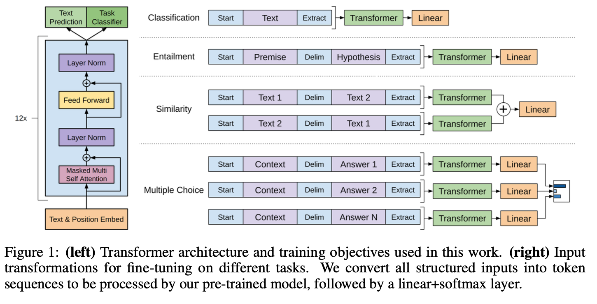
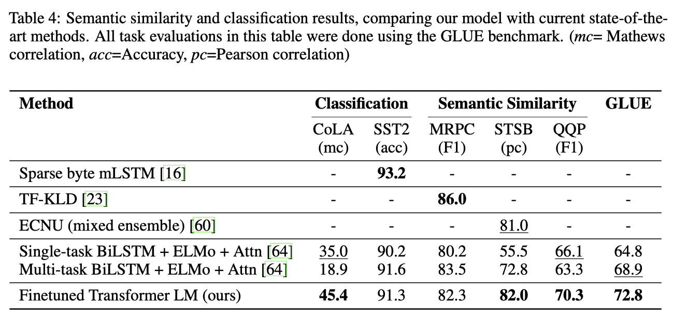
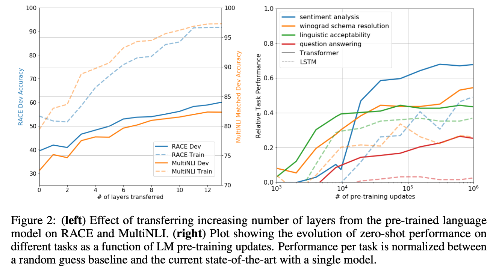

[[2018radford_gpt.pdf]]
#attention
[[2018liu_transformer-wikipedia]]

# Contribution 

   Uses transformer network with semi-supervised training that employs generative pretraining to improve metrics across the board with a 117M parameter model. This outperforms previous models solely trained on discriminative datasets. 

# Background 

   At this point, the superiority of the transformer is undisputed. The next problem is having access enough labeled data for supervised, i.e. discriminative, training. Previous papers mostly either use domain-specific tricks or focus too much on training to a tailored dataset, so its general capabilities outside its domain are not good. Also, they are only dominant in a few specific metrics and not across the board. If we can pretrain it over an extremely large database, at which point only unlabeled data provides such a large-enough dataset, then we can have improved cross-domain performance. 

   Some tasks are natural language inference, question answering, semantic similarity, text classification. They look at 12 different tasks, and GPT outperforms in 9 of them.  

   This is basically semi-supervised learning. People have done this recently, such as using pretrained word embeddings as initializations for larger models. This was also done in the early days with Hinton before imagenet was available. Unsupervised pretraining is a subset of semi-supervised learning, where goal is to find good initialization instead of modifying supervised learning objective. In some cases, pretraining acts as regularization. 

# Architecture 

   We have a multilayer transformer decoder for language model. For review, it has multiheaded self-attention over input context tokens followed by position-wise feedforward layesr to produce distribution over target tokens. 

   $$
   \begin{align}
      h_0 & = UW_e + W_p \\
      h_l & = \text{transformer\_block}(h_{l-1}) \quad \forall i \in [1,n] \\
      P(u) & = \text{softmax}(h_n W_e^T)
   \end{align}
   $$
   where $U = (u_{-k}, \ldots, u_{-1})$ is the context vector of tokens, $n$ is the number of layers, $W_e$ is the token embedding matrix, and $W_p$ is the position embedding matrix. 

   Use a 12-layer transformer decoder with masked self-attention heads (768-dimensional hidden states). For FF nets, used 3072-dimensional hidden layers. 

   Adam with max LR of 2.5e-4. Increased linearly from 0 over first 2k updates and annealed to 0 using cosine schedule. 

   Train for 100 epochs on minibatches of 64 randomly sampled, contiguous sequences of 512 tokens. 

   Layernorm was used and weights initialized with $N(0, 0.02)$. 

   Weight decay with parameter $0.1$. For activation, used GELU. 

# Generative Pretraining 

   We do not assume that the unsupervised dataset is of the same domain as what you want. Given an unsupervised corpus of tokens $\mathcal{U} = \{u_1, \ldots, u_n\}$, we use a standard language modeling objective to maximize the following likelihood:
   $$
      L_1(\mathcal{U}) = \sum_i \log P(u_i | u_{i-k}, \ldots, u_{i-1}; \Theta) 
   $$
   where $k$ is the size of the context window, and the conditional probability $P$ is modeled using a neural network with parameters $\Theta$. These parameters are trained using stochastic gradient descent. 

# Discriminative Fine Tuning 

   Then we fine tune with discriminative datasets. 

## Text Classification 

   For classification, take a labeled dataset $\mathcal{C}$, with each instance being a sequence of input tokens $(x^1, \ldots, x^m)$ with label $y$. 
   1. The inputs are passed through the pretrained model to obtain the final transformer block's activation $h_l^m$. 

   2. Then this activation $h_l^m$ goes through a linear layer to get the logits, at which point we can softmax to get probabilities. 
   $$
      P(y|x^1, \ldots, x^m) = \text{softmax}(h_\ell^m W_y)
   $$

   Therefore we have the following objective to maximize. 
   $$
      L_2(C) = \sum_{(x,y)} \log P(y|x^1, \ldots, x^m)
   $$

   They also found that including the language modeling objective to fine-tuning helped in generalization and accelerated convergence. So we actually work with this objective. 
   $$
      L_3 (\mathcal{C}) = L_2(\mathcal{C}) + \lambda \cdot L_1 (\mathcal{C})
   $$ 
   Note that the unsupervised objective is on $\mathcal{C}$, not $\mathcal{U}$. 

## Other Task Specific Input Transformations 

   Text classification is simple enough, but other specific tasks have some structure to them. To accomodate this, we need to slightly modify our architecture while still keeping it as general as possible. 

   1. *Textual Entailment*. We concatente the premise $p$ and hypothesis $h$ token sequences, with delimiter token (\$) in between. 

   2. *Similarity*. There is no inherent ordering of the two sentences being compared. To reflect this, they modify input sequence to contain both possible sentence orderings (with delimiter in between) and process each independently to produce two distinct sequence representations $h_l^m$ and $(h^\prime)^l_m$ which are added element-wise before being fed into the linear output layer. 

   3. *Question Answering and Commonsense Reasoning* . QA has structured inputs, such as ordered sentence pairs, or triplets of document/question/answers. Given context document $z$, question $q$, and set of possible answers $\{a_k\}$, first concatenate the document context and question with each possible answer, adding delimiter token in between to get $[z; q; \$; a_k]$. Each of these sequences are processed independently and normalized via softmax to produce output distribution over possible answers. (This prob isn't the most flexible or computationally efficient). 

   

# Results 

   Used BooksCorpus dataset for training language model. Contains 7000+ unique unpublished books, with long stretches of contiguous text, allowing model to learn to condition on long-range information. 

   For task-specific training, we have the table. 

   | Task | Datasets |
   |------|----------|
   | Natural language inference | SNLI, MultiNLI, Question NLI, RTE, SciTail |
   | Question Answering | RACE, Story Cloze |
   | Sentence similarity | MSR Paraphrase Corpus, Quora Question Pairs, STS Benchmark |
   | Classification | Stanford Sentiment Treebank-2, CoLA |

   
   The results show promise, achieving SOTA on 9 out of 12 datasets, even outperforming ensembles. Also works well on datasets of different sizes. 

   

   Also for analysis, transferred a variable number of layers to see how well the generative pretraining had improved. We can see that increasing the number of layers transferred increases metrics across different tasks. 

    

