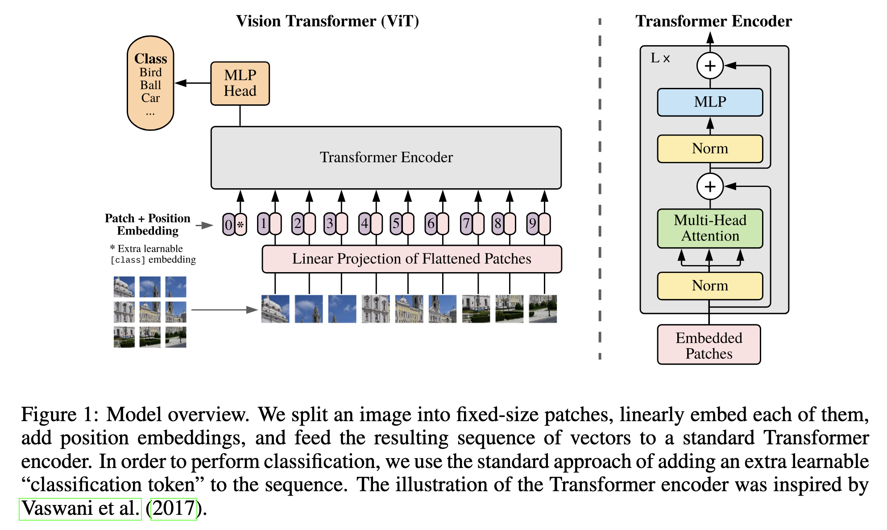
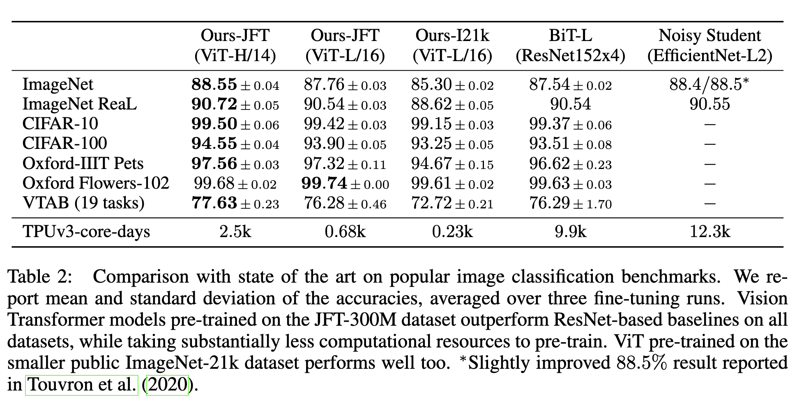

[[2020dosovitskiy_vit.pdf]]
#transformer #cv
[[2017vaswani_attention-transformer]], [[2020kolesnikov_big-transfer]]

# Contribution 

   Extends transformer architecture to images. After long training, they do better than CNNs.  
   
# Background 
   
   It is pretty obvious from the BIT paper they compared their results to, the design of the plots, and the fact that they used a dataset (JFT-300M) available only to Google, that it was Google that did it. Sorta defeats the purpose of anonymous peer review. 

   Attention has operated on sequences so far (or really just sets of $n$ tokens). Attention is a quadratic operation, $O(n^2)$ since we have to calculate the pairwise inner product. For sentences, this is manageable, but not for long essays. This gets even worse for images, where each pixel is a token, and so there are on the order of thousands or millions of pixels. Computation is hopeless since we must model every pixel trying to attend to every other pixel. We can try to do this locally by attending to a receptive field (neighborhood), but this is sort of the idea of CNNs. 

   They do an alternative solution. Just try to tokenize them into chunks of pixels: an image is partitioned into $16 \times 16$ chunks/tokens. 

# Architecture 

   Do the following. 
   1. Divide an image of size $(C, H, W)$ into patches and turn them into a set of patches. Take each patch in $\mathbb{R}^{P \times P}$, unroll it into $p \in \mathbb{R}^{P^2}$, and project it into some latent space $E p$ where $E$ is the embedding linear map. Therefore we have $N = HW / P^2$ patches. 

   2. However, we want to know the location of each patch since its still just a set. So we add positional embeddings. We could do 2-D indexing, e.g. (1, 1), (1, 2), (1, 3)..., or relative positional encoding, but they claim that this doesn't really help. Rather, we just add indices 1, 2, 3, ...  Now the actual value that they feed in are not natural numbers like this; they are learnable. That is, we have a table where each $n \in N$ is associated with $v_n \in \mathbb{R}^k$, and $v_n$ is learnable. We concatenate/add (idk, they didn't specify) the positional embeddings with the patch. 

   3. Similar to BERTs `[class]` token, they prepend a learnable embedding to sequence of embedded patches ($\mathbf{z}_0^0 = \mathbf{x}_\text{class}$). Therefore, the total output looks like 

   $$
      \mathbf{z}_0 = [\mathbf{x}_\text{class}; \mathbf{x}_p^1\mathbf{E}; \mathbf{x}_p^2\mathbf{E}; \ldots ; \mathbf{x}_p^N\mathbf{E}] + \mathbf{E}_{pos}, \quad \mathbf{E} \in \mathbb{R}^{(P^2 \cdot C) \times D}, \mathbf{E}_{pos} \in \mathbb{R}^{(N+1) \times D} 
   $$

   3. Once we have the $N+1$ input tokens, we input them in the standard transformer encoder. Let $\mathbf{z}_\ell = \mathbf{z}_\ell^1, \ldots, \mathbf{z}_\ell^N$ be the outputs of the $\ell$th multihead self-attention layer. 

   $$
   \begin{align}
      \mathbf{z}'_\ell &= \text{MSA}(\text{LN}(\mathbf{z}_{\ell-1})) + \mathbf{z}_{\ell-1}, \quad \ell = 1 \ldots L \\
      \mathbf{z}_\ell &= \text{MLP}(\text{LN}(\mathbf{z}'_\ell)) + \mathbf{z}'_\ell, \quad \ell = 1 \ldots L
   \end{align}
   $$

   4. We take the output of the encoder, and focus on the first element $\mathbf{z}_L^0$ in the sequence, which serves as the latent image representation $\mathbf{y}$. We then run $\mathbf{y} = \text{LN}(\mathbf{z}_L^0)$ through a standard MLP with one hidden layer for classification with GELU activations. 

   They also do have a version where they replace the linear projection of flattened patches with a convolutional embedding, but it doesn't help much. They want to show that convolutions are not necessary. 

    

# Training 

   They have 3 models. 

   | Model      | Layers | Hidden size D | MLP size | Heads | Params |
   |------------|--------|---------------|----------|-------|--------|
   | ViT-Base   | 12     | 768           | 3072     | 12    | 86M    |
   | ViT-Large  | 24     | 1024          | 4096     | 16    | 307M   |
   | ViT-Huge   | 32     | 1280          | 5120     | 16    | 632M   |

   They typically train ViT on larger datasets and fine tune on smaller (often with higher resolution) datasets with same patch size. 

# Results 

   Turns out that ViTs cost less computation and achieve higher accuracy than previous large CNNs, e.g. BiT. Vit-X/P means that the images are divided into patches of size $P \times P$, so smaller is intuitively better. Patch sizes of size 14 gives best results. 

   

   Note that the ViT model has much less image-specific inductive bias than CNNs. In CNNs, the 2-dim structure, translation invariance, and locality are all baked in. In ViTs, the MLP layers are local and translationally invariant, while self-attention layers are global. The 2-D neighborhood structure is used very sparingly. 
