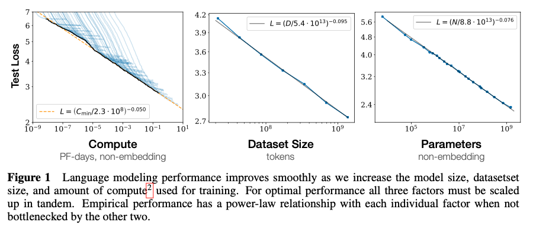

[[2020kaplan_scaling-laws-for-lm.pdf]]
#deep-learning
#natural-language-processing
[[2019radford_gpt2]]

# Contributions 

   Basically trains and evaluates a lot of LLMs to see how their performance scales will factors like latent dimension width, number of layers, parameters, and dataset size. This allows us to find the optimal allocation of a fixed compute budget. 

# Discoveries 

   **Performance depends strongly on scale, weakly on model shape:** Model performance depends most strongly on scale, which consists of three factors: the number of model parameters N (excluding embeddings), the size of the dataset D, and the amount of compute C used for training. Within reasonable limits, performance depends very weakly on other architectural hyperparameters such as depth vs. width.

   **Smooth power laws:** Performance has a power-law relationship with each of the three scale factors N,D,C when not bottlenecked by the other two, with trends spanning more than six orders of magnitude. We observe no signs of deviation from these trends on the upper end, though performance must flatten out eventually before reaching zero loss.

   **Universality of overfitting:** Performance improves predictably as long as we scale up N and D in tandem, but enters a regime of diminishing returns if either N or D is held fixed while the other increases. The performance penalty depends predictably on the ratio N^0.74/D, meaning that every time we increase the model size 8x, we only need to increase the data by roughly 5x to avoid a penalty.

   **Universality of training:** Training curves follow predictable power-laws whose parameters are roughly independent of the model size. By extrapolating the early part of a training curve, we can roughly predict the loss that would be achieved if we trained for much longer.

   **Transfer improves with test performance:** When we evaluate models on text with a different distribution than they were trained on, the results are strongly correlated to those on the training validation set with a roughly constant offset in the loss – in other words, transfer to a different distribution incurs a constant penalty but otherwise improves roughly in line with performance on the training set.

   **Sample efficiency:** Large models are more sample-efficient than small models, reaching the same level of performance with fewer optimization steps and using fewer data points.

   **Convergence is inefficient:** When working within a fixed compute budget C but without any other restrictions on the model size N or available data D, we attain optimal performance by training very large models and stopping significantly short of convergence. Maximally compute-efficient training would therefore be far more sample efficient than one might expect based on training small models to convergence, with data requirements growing very slowly as D∼C^0.27 with training compute.

   **Optimal batch size:** The ideal batch size for training these models is roughly a power of the loss only, and continues to be determinable by measuring the gradient noise scale; it is roughly 1-2 million tokens at convergence for the largest models we can train.

   Taken together, these results show that language modeling performance improves smoothly and predictably as we appropriately scale up model size, data, and compute. We expect that larger language models will perform better and be more sample efficient than current models 

   

