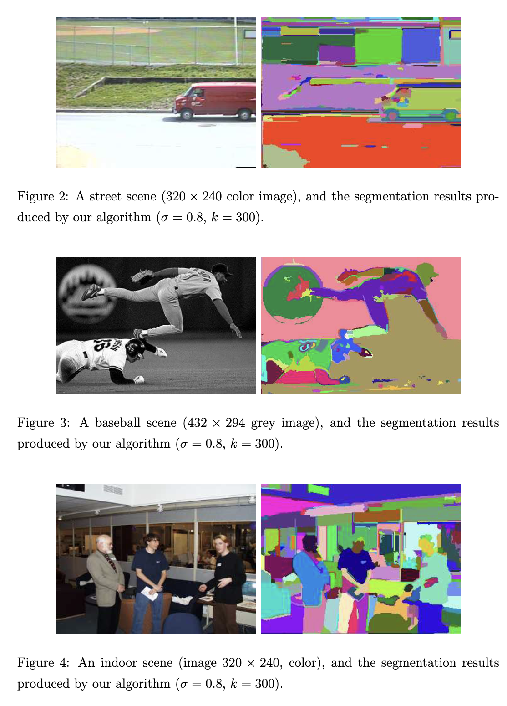

[[2004felzenszwalb-graph-image-seg.pdf]]
#computer-vision:segmentation

# Contribution 
   
   Invents a graph-based algorithm for undirected graph segmentation into components. This can be applied to images, which gives nice segmentation. 

# Implementation 

   Take a weighted directed graph where weights represent how dissimilar two nodes are. 

   Definitions. 
   1. **Internal difference** of component $C \subset V$ is the largest weight in the MST of $C$. $Int (C)$. 
   2. **Difference between two components** $C_1, C_2 \subset V$ to be min weight edge connecting two components. $Dif (C)$. If there is no edge connecting, then $Dif = \infty$. This might be problematic since it looks strictly at the smallest weight edge, but (1) making it more robust to find median or quantile is NP-hard, and (2) it turns out to be fine in practice. 
   3. To find out whether there is a boundary, we look the **pairwise comparison predicate** which is 

   $$
      D(C_1, C_2) = \begin{cases} 
         \mathrm{true} & \text{ if } Dif(C_1, C_2) > MInt (C_1, C_2) \\ 
         \mathrm{false} & \text{ else} 
      \end{cases}
   $$
   where minimum internal difference is defined 

   $$
      MInt(C_1, C_2) = \min( Int(C_1) + \tau(C_1), Int(C_2) + \tau(C_2)) 
   $$
   where threshold function $\tau$ controls the degree to which the difference of the two components must be greater than their internal differences in order for there to be evidence of boundary. They use $\tau (C) = k/ |C|$, where $|C|$ is the number of nodes in $C$, and so larger $k$ causes a preference for larger components. 

   Then they define what it means for segmentation to be too fine, then refinements of segmentations, and then too coarse. Then they prove that there exists a (nonunique) segmentation that is neither too fine nor too coarse. 

   Finally, they produce an algorithm to segment, which runs in $O(n \log{n})$ time and is very similar to Kruskal. 

# On Images 
   
   Given an image, we can treat each pixel as a node $v \in V$, and we define the edges to be the $8$-neighbors of it, giving us a graph $G = (V, E)$. They also smooth it with Gaussian filter of $\sigma = 0.8$ to remove digital artifacts. 

   For color images, they run the algorithm 3 times on each channel, and then compute the intersection of the segmentations, i.e. two pixels are in the same component if they are in the same component in all three channels. 

# Results 

   
