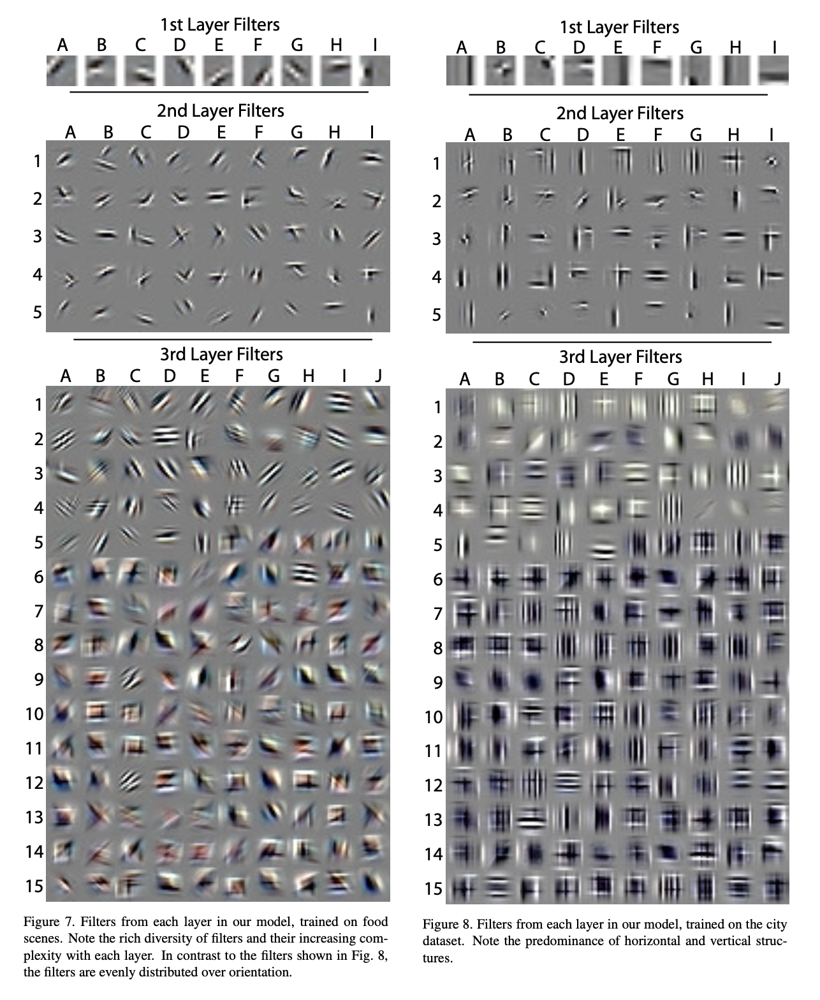

[[2010zeiler_deconvnets.pdf]]
#deep-learning:convolution
[[1998lecun_lenet]]
## Background 

   CNNs are not very interpretable as in we don't know what these features represent in latent space. We would like to visualize them in image/pixel space at all layers to see how they evolve from simple to more complex features. 

   [Slides](https://helper.ipam.ucla.edu/publications/gss2013/gss2013_11315.pdf) by Matt Zeiler for more reference. Apparently was too long ago to retrieve code from messaging him on LinkedIn. Also he did it in matlab. 

## Contribution 

   An upsampling layer that attempts to invert convolutional layers, called *deconvolutional layers*. Two warnings: 
   1. Deconvolution is not the same as deconvolution in the mathematical sense, which is the inverse of a function. Since a convolution is many to one an inverse cannot exist. 
   2. This is not strictly the same as transposed convolution, which is another upsampling method that acts on the image as a tranposed matrix multiplication.  However PyTorch cites this paper in their docs for `ConvTranspose2d` method. 

   General idea to compute the deconvolution is to take image $y$ and for each of its channels $y_c$, find sparse images $z_k$'s such that if we take a linear combination of the convolved $z_k$, then we can reconstruct $y_c$. 

   $$
      y_c \approx \sum f_{k, c} \ast z_k
   $$

   This isn't really an upsampling per say (?), but it allows us to directly view each $f_{k, c} \ast z_k$ in pixel space. This allows us to view what the CNN is interpreting each $z_k$ as and what features are important. This is summarized by asking the following question, gotten from [Jason](https://stackoverflow.com/questions/69782823/understanding-the-pytorch-implementation-of-conv2dtranspose): ''What arguments would I give to a normal, forward convolution layer such that it would give the tensor at hand, that I'm feeding into a transposed conv layer?''

## Implementation 

   Recall sparse dictionary learning, where we find an over-complete linear decomposition of input $y \in \mathbb{R}^d$ using dictionary $D^{d \times m}$, which has the total loss function 

   $$ 
      \min_D \frac{1}{N} \sum_{i=1}^N \min_{p^{(i)}} \| Dp - x^{(i)}\|_2^2  + \; \lambda \|p\|_1
   $$

   Learning $D$ and $p$ leads to an overcomplete representation, so we add a sparsity term to the loss. Therefore, we can try to model every element $x$ as some sparse linear combination of important features in $D$. We take a similar approach, but rather than each column of $D$ being in the pixel space, we embed it in latent space. 

   Consider an input image $y^i \in (K_0, N_r, N_c)$, and let each channel be $y^i_c \in (N_r, N_c)$. We want to represent the image $y^i_c$ as a linear combination of $K_1$ latent representations $z^i_k$. Note that $K_1$ is analogous to $m$ above. 

   The parameters of the deconvolution layers consist of filters $\{f_{k, c} \in (H, H)\}_{k \in K_{1}, c \in K_{0}}$ and latent feature embeddings $\{z^i_k \in (N_r + H - 1, N_c + H - 1)\}_{k \in K_1}$. These shapes ensure that the convolution 

   $$ 
      f_{k, c} \ast z_k^i = f_{k, c} \oplus z_k^i \in (N_r, N_c) 
   $$ 

   Great, so for each channel, we use the convolutions to map it from the higher dimensional latent space to the original input space while also computing the coefficients for the linear combination. 

   $$ 
      \hat{y_c^i} = \sum_{k=1}^{K_1} z_k^i \oplus f_{k, c}
   $$ 

   Note that the convolutions are learned across both the input channels $K_0$ and latent channels $K_1$, while there are a fixed $K_1$ latent features to learn. We optimize over all $z$ and $f$. However, this is an underdetermined system, so we add a sparsity regularization term to the $z^i$. We do this because we want the latent features to be like edges and simple shapes, while the convolutions as feature extractors shouldn't be limited in complexity. 
   
   $$
      C_1(y^i) = \frac{\lambda}{2} \sum_{c=1}^{K_0} \left\| \sum_{k=1}^{K_1} z_k^i \oplus f_{k,c} - y_c^i \right\|_2^2 + \sum_{k=1}^{K_1} |z_k^i|^p
   $$ 

   Now we can stack the layers, where we treat the feature maps $z^i_{k, l}$ of layer $l$ as input for layer $l+1$. That is, layer $l$ has input an image with $K_{l-1}$ channels, i.e. $\{z^i_{k, l-1}\}_{k = 1}^{K_{l-1}}$. Therefore, the loss of layer $l$ is 

   $$
      C_l(y) = \frac{\lambda}{2} \sum_{c=1}^{K_{l-1}} \left\| \sum_{k=1}^{K_l} g_{k,c}^l \left( z_{k,l}^i \oplus f_{k,c}^l \right) - z_{c,l-1}^i \right\|_2^2 + \sum_{k=1}^{K_l} |z_{k,l}^i|^p 
   $$

   Summing over the whole dataset of $I$ images $y = \{y^1 ,\ldots, y^I\}$ gives 

   $$
      C_l(y) = \frac{\lambda}{2} \sum_{i=1}^{I} \sum_{c=1}^{K_{l-1}} \left\| \sum_{k=1}^{K_l} g_{k,c}^l \left( z_{k,l}^i \oplus f_{k,c}^l \right) - z_{c,l-1}^i \right\|_2^2 + \sum_{i=1}^{I} \sum_{k=1}^{K_l} |z_{k,l}^i|^p 
   $$

   where $g$ is a fixed binary matrix determining connectivity between layers so that appropriate pairs are compared. We train this and the learned filters are $f^l_{k, c}$. 

   To use this model, take image $y^\prime$. 
   1. We infer feature maps $z_{k, 1}$ for layer $1$ by using the input $y^\prime$ and filters $f_{k, c}^1$ by minimizing $C_1 (y^\prime)$. 
   2. We take feature maps $z_{k, 1}$ and project them back to image space with the $f$ to reconstruct the image. 
   3. Then we update the feature maps $z_{k, 2}$ for layer $2$, and continue the same thing. 

   Assuming this is all trained, for each image the layer will produce sparse latent features, which the paper calls sparse feature maps. 

## Training 

   In practice, the optimization is now easy so they add in an auxiliary term $x$ and optimize iteratively between $x$ and $z$. 

## Results

   Trained a 3 layer model for pictures of fruits and city buildings. 1st layer had 9 feature maps, 2nd 45, 3rd 150. 

   

   
