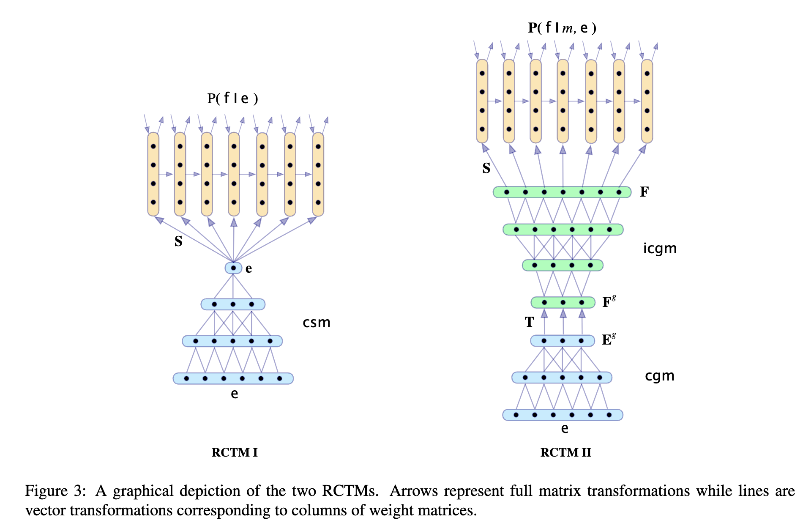

[[2013kalchbrenner_rnn-translation.pdf]]
#deep-learning:natural-language-processing
[[2010mikolov_rnn-language]], [[2013kalchbrenner_rcnn-discourse]]

# Contribution 

   Creates a rnn-based translation (source to target language) called the Recurrent Continuous Translation Models (RCTM). Two architectures. 
   1. First uses conv sentence model (see `2013kalchbrenner_rcnn-discourse`) encodes entire source sentence in a vector, which is 

   

# Background 

   The fact that there are rare words in languages (see `2010mikolov_rnn-language`), which may grow exponentially w.r.t. length of phrases, is a problem. This is a sparsity issue (too sparse?). Continuous representation of words is quite nice and avoids this problem. 

# First RCTM 

   Let $e = e_1, \ldots, e_k$ be source sentence and $f = f_1, \ldots, f_m$ be target. Then we want to model 

   $$ 
      P(f \mid e) = \prod_{i=1}^m P(f_i \mid f_{1:i-1}, e)
   $$ 

   Given source and target vocabularies $V^E$ and $V^F$, let $\mathrm{csm}(e)$ be the convolutional sentence embedding. Then, we can model it as such. 

   $$ 
   \begin{align}
      \mathbf{s} & = \mathbf{S} \cdot \text{csm}(\mathbf{e}) \\ 
      h_1 & = \sigma(\mathbf{I} \cdot v(f_1) + \mathbf{s}) \\
      h_{i+1} & = \sigma(\mathbf{R} \cdot h_i + \mathbf{I} \cdot v(f_{i+1}) + \mathbf{s}) \\
      o_{i+1} & = \mathbf{O} \cdot h_i
   \end{align}
   $$ 

   This makes sense, since the hidden state is dependent on the input sentence $e$ the whole way, and it gets updated by the previous hidden state along with the current translated word. Then we compute probabilities as such. 

   $$ 
      P(f_i = v|f_{1:i-1}) = \frac{\exp(o_{i,v})}{\sum_{v=1}^{V} \exp(o_{i,v})}
   $$

   Two weaknesses.  First, the length of the target sentence is predicted by the target RLM itself that by its architecture has a bias towards shorter sentences. Secondly, the representation of the source sentence e constraints uniformly all the target words, contrary to the fact that the target words depend more strongly on certain parts of the source sentence and less on other parts. The next model proposes an alternative formulation of these aspects.

# Second RCTM 

   To fix the length problem, we try and to estimate the length $m$ of the target sentence. Given source sentence $e$ and length $m$, we construct a representation for the $4$-grams in $e$. Generally we want to model this distribution. 

   $$ 
      P(\mathbf{f}|\mathbf{e}) = P(\mathbf{f}|m, \mathbf{e}) \cdot P(m|\mathbf{e}) = \prod_{i=1}^{m} P(f_{i+1}|f_{1:i}, m, \mathbf{e}) \cdot P(m|\mathbf{e})
   $$

   Rather than just do a csm, we improve upon it. The cgm represents the convolutional n-gram model (and icgm is the inverse), which represents sentences into its $n$-grams. We set $n=4$. The 4-gram representation of e is thus constructed by truncating the CSM at the level that corresponds to n = 4.

   Then the RNN does forward pass as such. 

   $$ 
   \begin{align}
      \mathbf{E}^g & = \text{cgm}(\mathbf{e}, 4) \\
      \mathbf{F}^g_{:,j} & = \sigma(\mathbf{T} \cdot \mathbf{E}^g_{:,j}) \\ 
      \mathbf{F} & = \text{icgm}(\mathbf{F}^g, m) \\ 
      h_1 & = \sigma(\mathbf{I} \cdot v(f_1) + \mathbf{S} \cdot \mathbf{F}_{:,1}) \\ 
      h_{i+1} & = \sigma(\mathbf{R} \cdot h_i + \mathbf{I} \cdot v(f_{i+1}) + \mathbf{S} \cdot \mathbf{F}_{:,i+1}) \\ 
      o_{i+1} & = \mathbf{O} \cdot h_i
   \end{align}
   $$

   Note how each reconstructed vector $\mathbf{F}_{:,i}$ is added successively to the corresponding layer $h_i$ that predicts the target word $f_i$. Then we compute probabilities as such, same as before. 

   $$ 
      P(f_i = v|f_{1:i-1}) = \frac{\exp(o_{i,v})}{\sum_{v=1}^{V} \exp(o_{i,v})}
   $$

