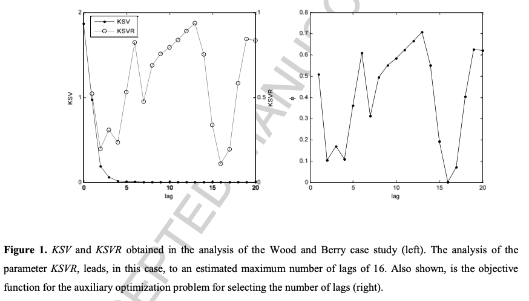

[[2013rato_dpca-lag-structure.pdf]]
#factors-and-components:pca:dynamic
[[1995ku_dynamic-pca-time-lag]]

# Contribution 

   Builds off Ku's DPCA to give a better method to determine the time lag $\ell$. They give one method to determine the best lag $l$, and a second method to identify a selection of lags. 

# Method 

   Say there are $n$ samples $x \in \mathbb{R}^m$. Then by the augmented (Hankel-like) data matrix is $n \times (m \times \ell)$. At the $l$th stage of the iteration, we define: 
   1. The **key singular value (KSV)** to be the $(m \times l + 1)$th largest singular value. It signals the point where the linear relationship requiring way finally achieved. So only after the point where there is a sufficient number of lags to describe all linear descriptions present, a small value appears in the KSV, indicating that the addition of a variable replicates with more lags is no longer relevant for the DPCA model. 
   2. The **key singular value ratio (KSVR)** which is defined $KSV(l) / KSV(l-1)$. This is because due to presence of noise and nonlinear effects, a small KSV may not be a robust indicator. They run empirical tests to see that there is a point where the KSV decays more or less sharply, so we introduce this first-order term. 

   Some empirical tests. 

   

   For method 2, read the paper. 
