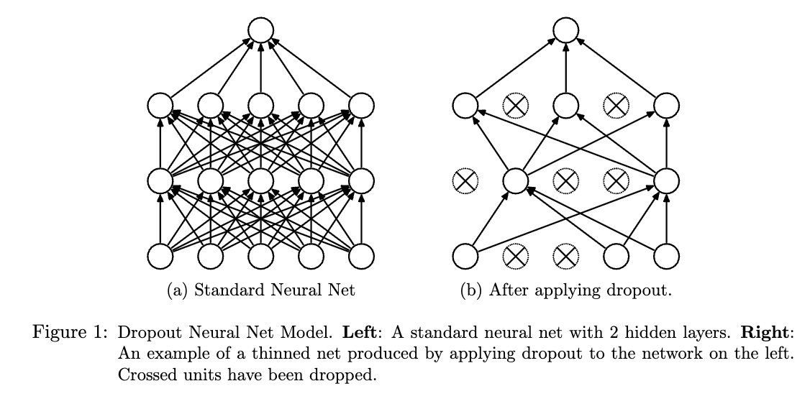
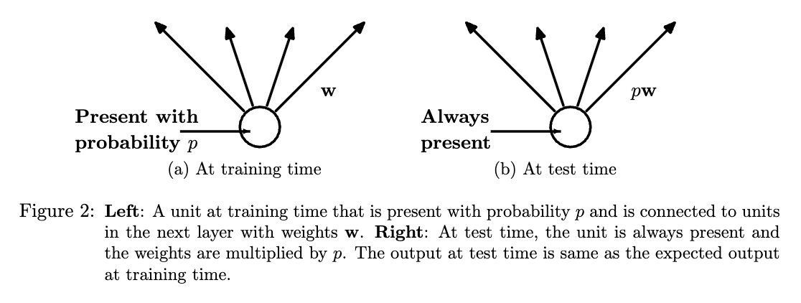

[[2013srivastava_dropout.pdf]]
#deep-learning:regularization
[[2012hinton_prevent-coadapting]]

# Contributions 
   
   Expands on Hinton's previous paper on dropout. 

# Background 

   With unlimited computation, the best way to "regularize" a fixed-sized model is to average the predictions of all possible settings of the parameters, weighing each setting by the posterior probability given the training data. This is the Bayesian gold standard, but since we can't do this, we would like to approximate it as an equally weighted geometric mean of the predictions of an exponential number of learned models that share parameters. 

   Even training a few nets is expensive, much less an exponential number of them. Therefore, we can perform dropout to simulate averaging. 

# Idea 

   Say you have dropout with probability $p$. At each mini-batch of training, each node will be dropped with a probability of $p$. Usually $p = 0.5$ but usually optimally closer to $1$. At this point, the nodes will not get updated, and we are masking the gradients. Doing so prevents coadapting of the weights. 

   

   A neural net of $n$ units can be seen as a collection of $2^n$ possible thined neural networks. These networks all share weights so that the total number of parameters is still $O(n^2)$. For each presentation of each trainig case, a new thinned network is sampled and trained. So training a neural network with dropout can be seen as training a collection of $2^n$ thinned networks with extensive weight sharing. 

   If a unit is retained with probability $p$ during training, the outgoing weights of that unit should be multiplied by $p$ at test time. This ensures that for any hidden unit, the **expected** output (under the distribution used to drop units at training time) is the same as the actual output at test time. This averaging should make sense. 

   

# Tips 
   
   Apparently constraining the norm to be upper bounded by fixed $c$ was very helpful, aka max-norm regularization. 

# Results 
   
   Trained on the following datasets. 
   1. MNIST 
   2. TIMIT 
   3. CIFAR-10/100 
   4. SVHN 
   5. ImageNet 
   6. Reuters-RCV1
