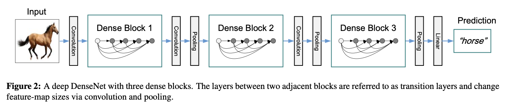
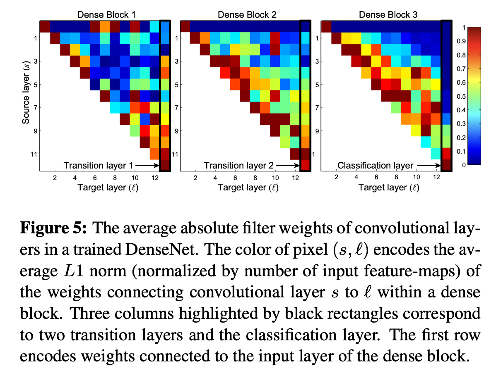

[[2016huang_densenet.pdf]]
#deep-learning:computer-vision

[[2015he_resnet]] 

# Contribution 

   Takes residual connections to the extreme. Regular convnets of $L$ layers have $L$ connections. Resnets have slightly more connections. DenseNets connect every layer to every other layer, resulting in $\frac{L(L+1)}{2}$ connections. This allows for easier training and reaches SOTA performance. 

# Background 

   With CNNs becoming deep, almost all methods to improve training was by adding extra connections. We take this to the extreme. 

# Architecture 

   We connect all layer with matching feature map sizes directly with each other. However, in contrast to resnets, we never combine features through summation before they are passed into a layer. Rather, we combine features by concatenating them. So the $\ell$th layer has $\ell$ inputs, consisting of feature maps of all preceding convolution blocks. Its own feature maps are passed onto all $L-\ell$ subsequent layers. For clarity, let's write out the equations. 
   1. Traditional CNN layers: $x_\ell = H_\ell (x_{\ell - 1})$. 
   2. Resnet layers: $x_\ell = H_\ell (x_{\ell - 1}) + x_{\ell - 1}$.  
   3. Dense layers: $x_\ell = H_\ell ([x_0, x_1, \ldots, x_{\ell - 1}])$ 

   This allows us to be more selective about what we want to keep or modify (like RNNs), and counterintuitively requires fewer parameters than traditional CNNs. Turns out that recent variations of resnets contribute very little and can be randomly dropped during training. 

   Each layer is a combination of batch normalization, ReLU, and Conv, along with pooling perhaps. Since pooling shrinks our dimension, we can't just have all dense layers. We must divide them into blocks and have pooling layers between the blocks. 

   

   A concern is that in a block, the layers will have more and more inputs to process, which may lead to more computation. So we just decrease the channels for all previous feature maps by using the $1 \times 1$ convolution as a bottleneck layer (like resnet). Therefore for each layer for the input, we can reduce it to $k$ dimensions to compress it, giving us $k (\ell - 1)$ total inputs. It turns out that a DenseNet can have very narrow layers, e.g. $k = 12$. Heuristic is that each layer has access to all preceding feature maps, and therefore the model's collective knowledge. 

   Turns out that looking back a few layers in a block may be important. 

   

   With layers and feature dimension $(L, k)$, the following were tested: $(40, 12), (100, 12), (100, 24), (250, 24), (190, 40)$. 

# Results 

   Error rates shown, with data augmentation. 
   1. CIFAR10: 3.46%
   2. CIFAR100: 17.18%
   3. SVHN: 1.59% 

