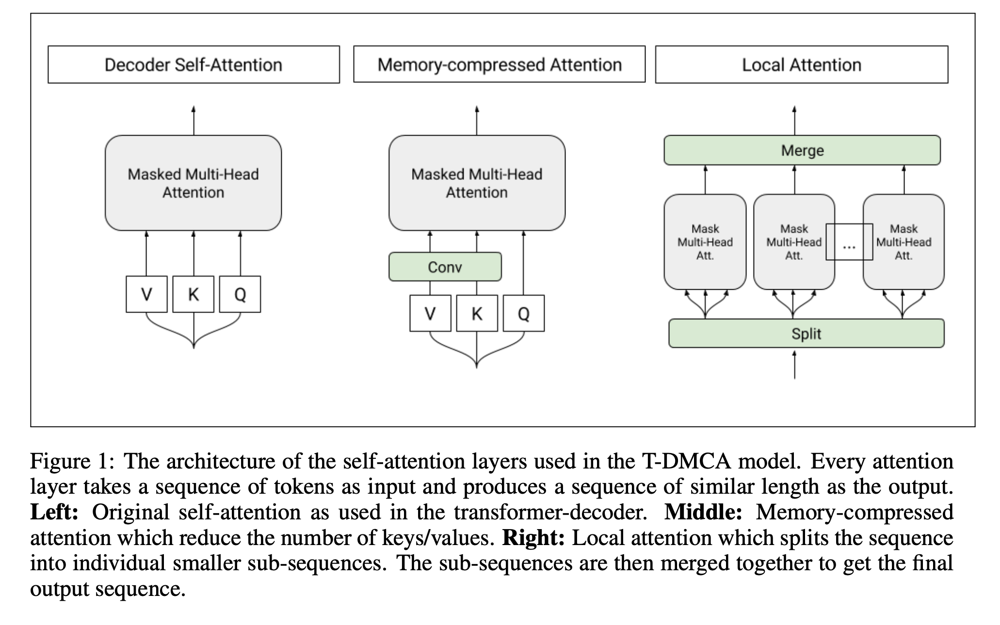
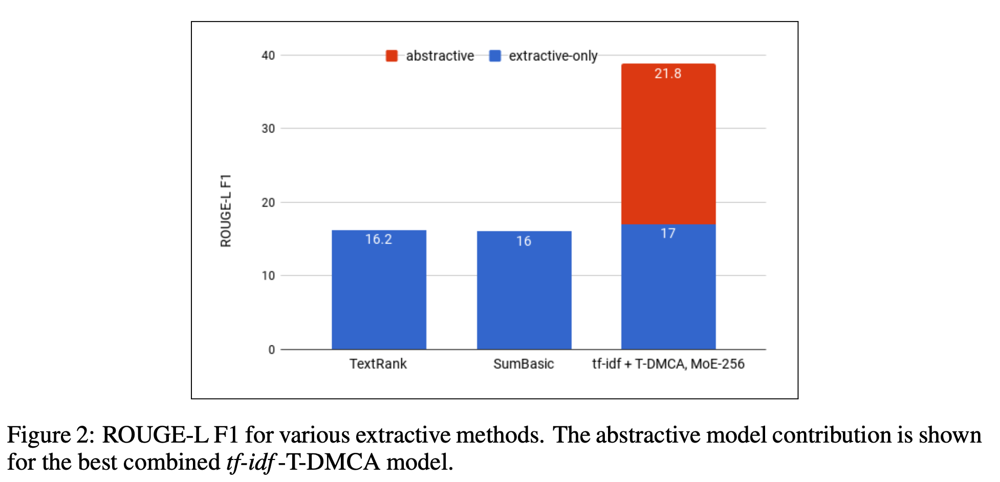
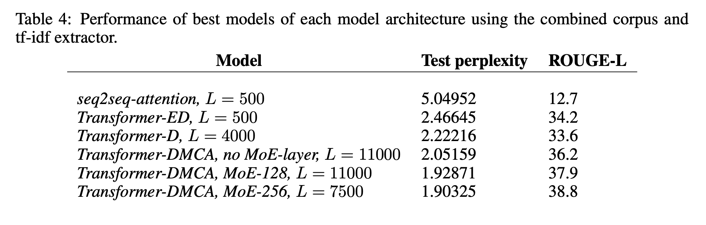

[[2018liu-transformer-wikipedia.pdf]]
#deep-learning:attention
[[2017vaswani_attention-transformer]]

# Contribution

   Uses a modified transformer (consisting of only a decoder) to generate the lead section of Wikipedia articles. Fully supervised. 

# Background 

   There are two types of summarization. Extractive summarization takes some article and selects specific sentences from it. Abstractive summarization is generative and produces new sentences. 

# Training 

   Train it on the Wikipedia dataset, called WikiSum. This is better than previous datasets because of the ROGUE score, which is a measure of how amenable a dataset is to extractive summarization. That is, given input and output $(I, O)$ if all words/unigrams in $O$ are in $I$, then ROGUE is 100, and if none, then $0$. Wikipedia has rogue score of 59.2 compared to 75+ for previous datasets consisting of news headlines and summaries (e.g. Gigaword and CNN/Daily Mail). 

   Divide a total of about 2.5M articles into 80/10/10 train/val/test splits. 

   Consider the set of all Wikipedia documents as $D$. 
   1. *Cited Sources.* For each article $a_i \in D$, take all the citations in that article and look at all of its documents, which we will denote $C_i \subset D$.  
   2. *Web Search Results.* Some low quality articles may not have enough citations, so we further augment, we crawl search results from Google search engine, suing article section titles as queries. For each query, collect 10 result pages. From this collection, remove the Wikipedia article itself. This is our set of refined search results, denoted $S_i \subset D$. 

   Therefore, $(C_i, S_i)$ is our input and the head of $a_i$ is our output. Note that the actual body (non-head part) of the Wikipedia article $a_i$ is *not* included in the input! 
   
   For both of these, we extract all the raw text as input. But both $(C_i, S_i)$ might be too large to fit into hardware memory, so we use extractive summarization to shorten it. Then conditioned upon this extraction, we train our neural model. Sort of like how humans might summarize: first take out relevant text, and then summarize from it.  

# Extractive Summarization

   Step 1. First thing to do is to do extractive summarization. For each article $a_i$, we have the tuple $(C_i, S_i)$ containing paragraphs $\{p^i_j\}$. We create a ranked list of paragraphs $\{p^i_{R_i (j)}\}$, where $R_i (j)$ is the rank of the $j$th paragraph $p^i_j$ of $(C_i, S_i)$. How do we do this ranking? There are multiple ways. 

   1. *Identity*. Just extract the first $L$ tokens. 
   2. *TF-IDF*. Let our query $T(a_i)$ be the title of the article $a_i$, and let us treat the paragraphs $p^i_j$ as documents themselves. Then for each word in the query $w \in T(a_i)$, we compute tf-idf for this word w.r.t. the paragraphs $\{p^i_j\}$ and sum them up. 
   $$ 
      R(a_i) = \sum_{w \in T(a_i)} N_w \cdot  \log \bigg(  \frac{N_d}{N_{dw}} \bigg)
   $$ 
   where $N_w, N_d, N_{dw}$ are the counts of the word in the document, total number of documents, and total number of documents containing the word, respectively. 

   3. *TextRank*. Represent each text unit as a node and edges are determined by a similarity measure based on word overlap. Then an algorithm similar to PageRank is used to rank the text units, and we take the top $L$. 

   4. *SumBasic*. Word frequencies in the input text are used to assign scores to words, which are in turn used to score sentences. After selecting the best scoring sentence, words in it have their scores reduced, and the process is repeated until the desired summary length is reached.

   5. *Cheating*. To further demonstrate the quality of extraction on the final performance, we implement a cheating extractor that ranks {p^i_j} using recall of bigrams in the ground truth text:
   $$
      d(p^i_j, a_i) = \frac{bigrams(p^i_j) \cap bigrams(a_i)}{bigrams(a_i)}
   $$

   Step 2. Great, so we have a ranking. The next step is to just extract the most relevant (highest ranking) tokens (paragraphs?). Say we want the top $L$. 

   1. We just derive the raw text input and concatentate them. We also prefix the title as well. 
   $$
      text_i = T(a_i) || \{p_{R_i}(j)\}
   $$

   2. Then use sub-word tokenization with vocab size of 32k. 
   $$
      tokenize(text_i) = x_i = (x_i^1, x_i^2, ..., x_i^{n_i})
   $$

   3. For values of $L$, we truncate. 
   $$
      m_i^L = (x_i^1, \ldots, x_i^{\min(L, n_i)}) 
   $$

   We do the same thing for the output except for the truncation. 

# Architecture

   Depending on the size of $L$, we treat it differently. If $L$ is large (e.g. 11,000), we treat it as a sequence transduction problem with seq2seq with attention. This encoder-decoder approach is pretty straightforward and is explained in Bahdanau. This is done by learning the map $(m^1, \ldots, m^n) \mapsto (y^1, \ldots, y^\eta)$ which can be done by maximizing 
   $$
      y_i = \mathrm{tokenize}(a_i), \qquad \max \prod_{i=1}^N p(y_i \mid m_i^L) 
   $$

   If $L$ is medium (less than 500), we use transformers and self-attention, called T-ED, which only has the decoder. They state that both the encoder and decoder may learn repetitive representations, so this may waste computation. Since the decoder is a language model, we have it learn the concatenation of both the input and output sentences. 
   $$ 
      (w^1, \ldots, w^{n + \eta + 1}) = (m^1, \ldots, m^n, \delta, y^1, \ldots, y^\eta)
   $$
   where $\delta$ is a special separator token and train a model to predict the next word given the previous ones. 
   $$
      p(w^1, ..., w^{n+\eta}) = \prod_{j=1}^{n+\eta} p(w^i|w^1, ..., w^{j-1})
   $$ 

   Because of the self-attention of the transformer, when generating the next token, attention from both $m$ and $y$ are considered. Beam search of size 4. 

   At inference, we provide the input sequence $m$ and autoregressively generate the output $y_i$ as normal. 

   They also have different variants to save memory, called Transformer-DMCA. 
   1. **Local Attention**.Sequence tokens are divided into blocks of similar length and attention is performed in each block independently. As the attention memory cost per block becomes constant, this modification allow us to keep the number of activations linear with respect to the sequence length. In our experiments, we choose to have blocks of 256 tokens. 
   2. **Memory-compressed transformers**. After projecting the tokens into the query, key, and value embeddings, we reduce the number of keys and values by using a strided convolution.

   

# Results 

   Used perplexity and ROGUE-L F1 (a metric to compare candidate and reference summaries).  Conclude that extractive summarization is definitely not enough. 

    

   Compare it to LSTM with attention (seq2seq-att) like in Bahdanau and we try to optimize the likelihood over the whole dataset. 

   

   

