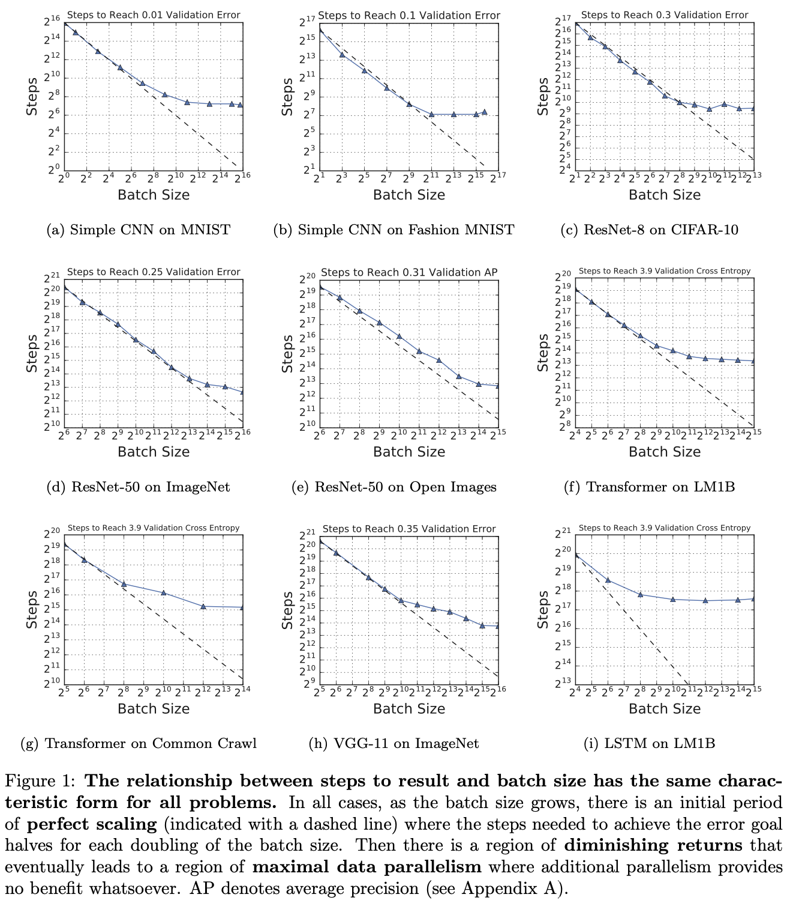

[[2019shallue_data-parallelism-effects.pdf]] 
#others

# Contribution 

   Studies how batch size (and consequently, other hyperparameters, esp optimization and regularization) affects the best OOS (validation) loss on various models and datasets (ranging from simple MLPs for MNIST to transformers on CommonCrawl). 

   Apparently, increasing batch size gives us *better* OOS error. This strongly motivates us to try to make batch size as large as possible. 

   
