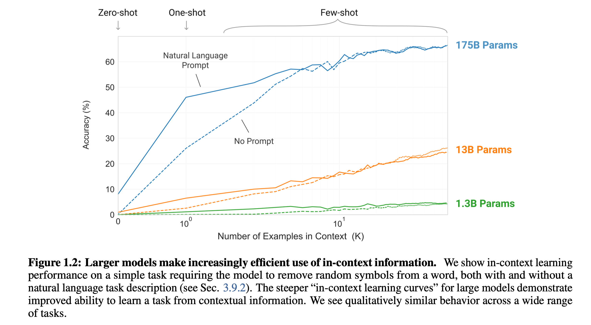
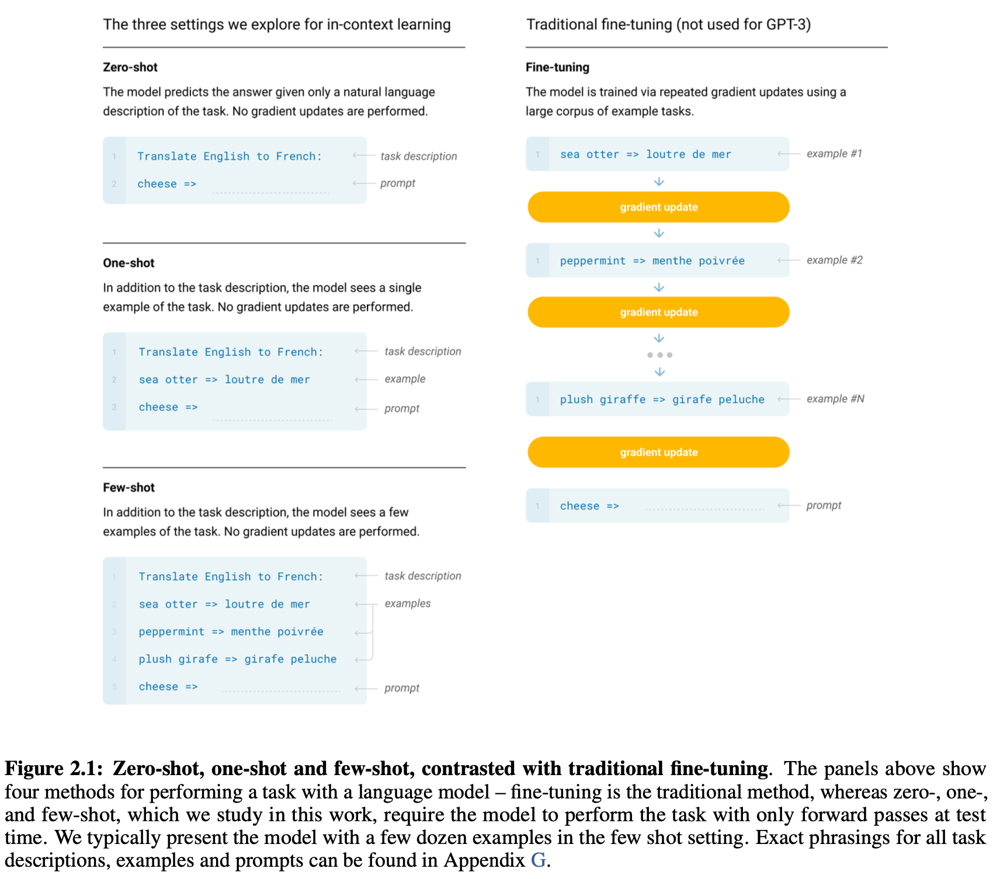
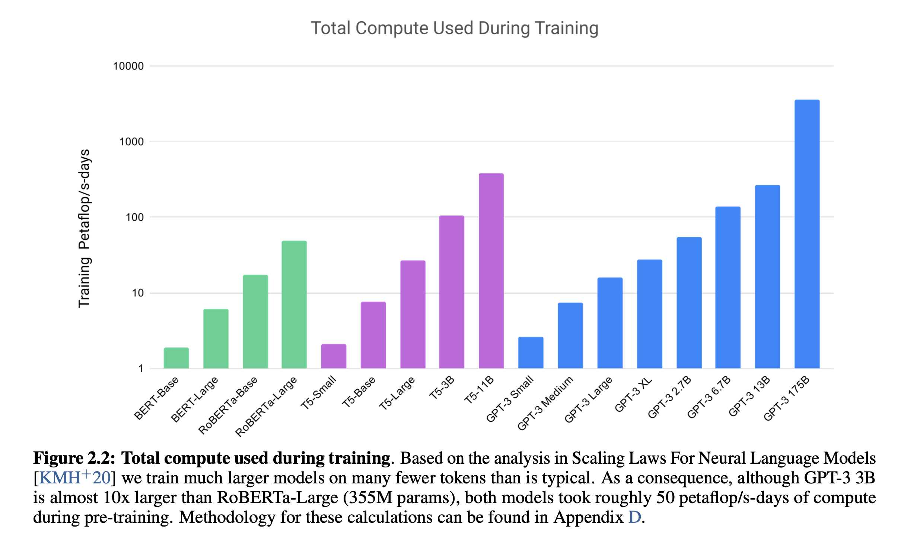
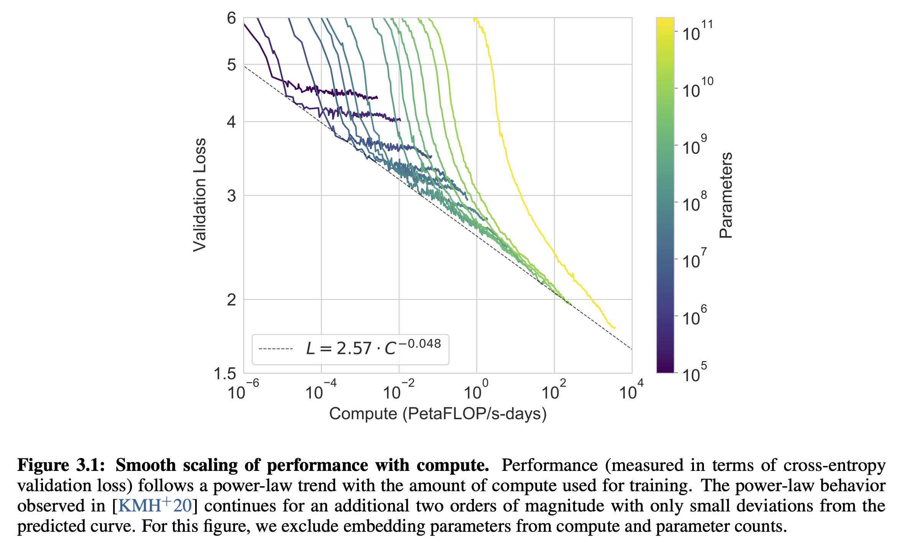

[[2020brown_gpt3.pdf]]
#deep-learning:attention #deep-learning:generative #deep-learning:meta-learning:zero-shot
#natural-language-processing:question-answer 
#natural-language-processing:classification 
#natural-language-processing:translation 
[[2019child_sparse-transformer]], [[2020kaplan_scaling-laws-for-lm]]

# Contributions 

   Extend GPT2 to a 175B parameter model, which after a ton of generative pretraining, shows great performance in zero, one, and few-shot learning. 
   1. Zero shot means that you train it on unsupervised dataset $\mathcal{U}$, and then just evaluate on a labeled dataset $\mathcal{C}$. 
   2. One shot means that you train it on $\mathcal{U}$, and then you take an input-output pair (a demonstration of a task), put it into the model's context memory, and then give it an input $x$ to predict $y$. This is different from training that you don't update the weights at all. The demonstration is *not* used to train the model.  
   3. Few shot means that you take a few training samples, which is however many will fit into the context window (usually 10 to 100). 

   Shows that models with higher capacity can learn more dramatically in one/zero/few-shot regime. 

   

# Architecture 

   Same architecture as GPT2, including modified initialization, pre-normalization, and reversible tokenization. However, they use an alternating dense and locally banded sparse attention patterns in the layers of the transformer, similar to sparse transformer. 

   Train 8 different sizes of models with the following hyperparams. All models trained for total of 300 billion tokens. They partition the model across GPUs along both depth and width dimension in order to minimize data transfer between nodes. The feedforward layer is always 4 times the size of the bottleneck layer. All models use a context window of 2048 tokens. 

   | Model Name | n_params | n_layers | d_model | n_heads | d_head | Batch Size | Learning Rate |
   |------------|----------|----------|---------|---------|--------|------------|---------------|
   | GPT-3 Small | 125M | 12 | 768 | 12 | 64 | 0.5M | 6.0 × 10⁻⁴ |
   | GPT-3 Medium | 350M | 24 | 1024 | 16 | 64 | 0.5M | 3.0 × 10⁻⁴ |
   | GPT-3 Large | 760M | 24 | 1536 | 16 | 96 | 0.5M | 2.5 × 10⁻⁴ |
   | GPT-3 XL | 1.3B | 24 | 2048 | 24 | 128 | 1M | 2.0 × 10⁻⁴ |
   | GPT-3 2.7B | 2.7B | 32 | 2560 | 32 | 80 | 1M | 1.6 × 10⁻⁴ |
   | GPT-3 6.7B | 6.7B | 32 | 4096 | 32 | 128 | 2M | 1.2 × 10⁻⁴ |
   | GPT-3 13B | 13.0B | 40 | 5140 | 40 | 128 | 2M | 1.0 × 10⁻⁴ |
   | GPT-3 175B or "GPT-3" | 175.0B | 96 | 12288 | 96 | 128 | 3.2M | 0.6 × 10⁻⁴ |

# Evaluation

   Take care of the cross-contamination problem with large crawled datasets (see more in GPT2 notes). 

   There are 4 main metrics for evaluation. 
   1. *Fine Tuning (FT)*. Trained on specific labeled dataset of thousands of samples. Advantage is strong performance, but has poor out-of-domain generalization. They don't fine-tune GPT3 here, but you could do it. 
   2. *Few Shot (FS)*. When model is given few demonstrations of task at inference time as conditioning. It works by giving $K$ input-output pairs (fit into the context window), and then 1 input, with it expected to produce an output. (Done every time?)
   3. *One Shot (1S)*. Same as FS but 1 demonstration is given into the context window. 
   4. *Zero Shot (ZS)*. No demonstrations, and the model is only given a natural language instruction describing the task. 

   

# Dataset

   Preparation of dataset is important. CommonCrawl, with over 1 trillion words (45TB), is big enough, but the data quality is low. So they did some preprocessing. 
   1. Quality filtering based on reference corpora: Rather than using raw Common Crawl data, they filtered it by comparing documents to high-quality reference datasets, keeping only content that was similar to these curated sources to improve overall data quality.
   2. Fuzzy deduplication to prevent overfitting: They removed duplicate or near-duplicate documents both within Common Crawl and across different datasets to avoid redundancy and ensure their validation set remained a reliable measure of model performance.
   3. Augmentation with curated datasets: They supplemented the filtered Common Crawl data with known high-quality reference corpora to increase diversity and further enhance the training mix beyond what Common Crawl alone could provide.

   After filtering, it was 570GB with about 400B tokens. Higher quality datasets are sampled more frequently, at the cost of slightly overfitting, though okay. 

   | Dataset | Quantity (tokens) | Weight in training mix | Epochs elapsed when training for 300B tokens |
   |---------|------------------|----------------------|---------------------------------------------|
   | Common Crawl (filtered) | 410 billion | 60% | 0.44 |
   | WebText2 | 19 billion | 22% | 2.9 |
   | Books1 | 12 billion | 8% | 1.9 |
   | Books2 | 55 billion | 8% | 0.43 |
   | Wikipedia | 3 billion | 3% | 3.4 |

   This table demonstrates GPT-3's oversampling of high-quality, smaller datasets. While Common Crawl provides the bulk of training data (60% weight, 410B tokens), smaller curated datasets like Wikipedia and WebText2 are heavily oversampled - Wikipedia is seen 3.4 times and WebText2 nearly 3 times during training. This approach prioritizes quality over quantity, ensuring that premium content from books and encyclopedic sources has disproportionate influence on the model despite representing smaller portions of the total available data.

# Training 

   Interesting to see how much compute was taken to train this. 

   

   Indeed, larger models tend to train faster and better. Should prob read the cited paper in the caption. 

   

# Results 

   GPT-3 shows smooth scaling with model size across nearly all tasks, with the 175B parameter model consistently outperforming smaller versions. Few-shot learning generally provides the best performance, followed by one-shot, then zero-shot. We investigate the task specific. 

   1. **Language Modeling & Completion**
     GPT-3 achieves new state-of-the-art on Penn Tree Bank language modeling (20.5 perplexity) and significantly improves on LAMBADA (86.4% few-shot vs 68% previous SOTA), demonstrating strong few-shot learning capabilities.

   2. **Question Answering**
     On closed-book QA tasks, GPT-3 matches or exceeds fine-tuned models on TriviaQA (71.2% few-shot) and approaches SOTA on WebQuestions, though performance varies significantly across different QA formats.

   3. **Translation**
     GPT-3 outperforms previous unsupervised machine translation work when translating into English, achieving competitive results with only a few examples, though it shows asymmetric performance favoring translation into English over other directions.

   4. **Reading Comprehension**
     Performance varies widely across datasets - GPT-3 performs well on conversational QA (CoQA: 85.0% few-shot) but struggles with structured tasks requiring precise reasoning like QuAC and DROP.

   5. **Common Sense & Reasoning**
     Mixed results, with strong performance on PIQA (82.8%) but weaker results on ARC and OpenBookQA. Winograd tasks show good performance (88.6%) with minimal benefit from few-shot learning.

   6. **SuperGLUE Benchmark**
     GPT-3 achieves 71.8% average performance, outperforming fine-tuned BERT-Large on 4 of 8 tasks, with particularly strong results on COPA and ReCoRD but notable weaknesses on tasks requiring sentence comparison.

   7. **Synthetic Tasks**
     - **Arithmetic**: Strong performance on 2-3 digit operations (100% on 2-digit addition), with ability extending to more complex calculations
     - **Word manipulation**: Successfully learns novel symbolic tasks like unscrambling words and character manipulation
     - **SAT Analogies**: Achieves 65.2% (above average college applicant performance of 57%)
     - **News generation**: Produces articles that humans can distinguish from real news only 52% of the time

# Limitations

   Some points below but should read section 5 for more comprehensive overview. 

   - Struggles with tasks requiring comparison between sentences or text snippets
   - Performance on natural language inference remains near chance level
   - Significant variation in performance across different task formats and domains
   - Some tasks show potential data contamination concerns 

   They also have a broader impacts section on the ethics of this. 

