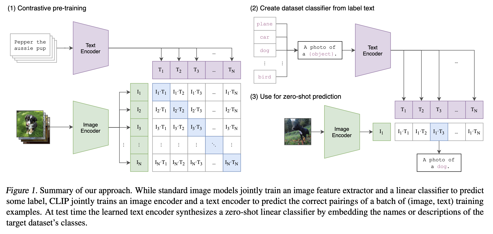

[[2021radford_clip.pdf]]
#deep-learning:computer-vision #deep-learning:natural-language-processing
[[2020dosovitskiy_vit]]

# Contribution 

   Introduces the CLIP model. Recognizes the limitations of having a fixed set of classes for SOTA vision models. Learning directly from raw text about images is a promising alternative which leverages a much broader source of supervision. We demonstrate that the simple pre-training task of predicting which caption goes with which image is an efficient and scalable way to learn SOTA image representations from scratch on a dataset of 400 million (image, text) pairs collected from the internet. After pre-training, natural language is used to reference learned visual concepts (or describe new ones) enabling zero-shot transfer of the model to downstream tasks. 

# Background 

   In NLP, pretraining on unlabeled text had really boosted zero-shot transfer learning capabilities. However, in vision it is still common to pretrain models on *crowd-labeled* datasets.  

# Model 

   The picture below is quite a good diagram. They provide numpy-syntax pseudocode. 
   ```
   # image_encoder - ResNet or Vision Transformer
   # text_encoder - CBOW or Text Transformer
   # I[n, h, w, c] - minibatch of aligned images
   # T[n, l] - minibatch of aligned texts
   # W_i[d_i, d_e] - learned proj of image to embed
   # W_t[d_t, d_e] - learned proj of text to embed
   # t - learned temperature parameter
   # extract feature representations of each modality
   I_f = image_encoder(I) #[n, d_i]
   T_f = text_encoder(T) #[n, d_t]
   # joint multimodal embedding [n, d_e]
   I_e = l2_normalize(np.dot(I_f, W_i), axis=1)
   T_e = l2_normalize(np.dot(T_f, W_t), axis=1)
   # scaled pairwise cosine similarities [n, n]
   logits = np.dot(I_e, T_e.T) * np.exp(t)
   # symmetric loss function
   labels = np.arange(n)
   loss_i = cross_entropy_loss(logits, labels, axis=0)
   loss_t = cross_entropy_loss(logits, labels, axis=1)
   loss = (loss_i + loss_t)/2
   ```

   

